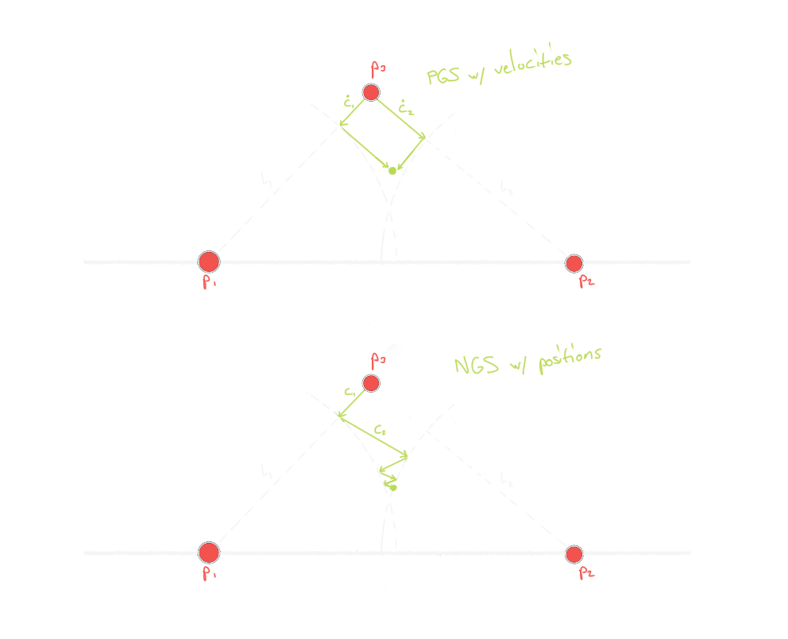
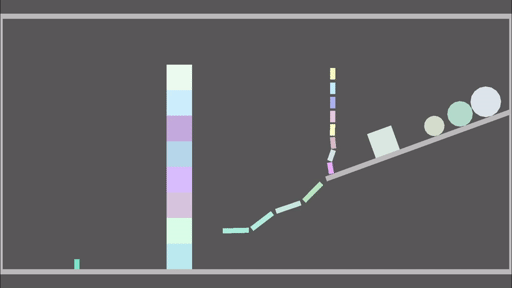

+++
title = "Starframe devlog: Solving Constraints in Physics"
date = 2021-03-31
slug = "starframe-constraints"
aliases = ["blog/2021/03/starframe-devlog-constraints/"]
[taxonomies]
tags = ["starframe", "physics"]
[extra]
use_katex = true
+++

The [Starframe] physics solver has gone through a few iterations recently as my
understanding of the problem and knowledge of available methods have grown. In
this post I attempt to explain what constraints are and detail a few
game-engine-friendly ways of solving them. I'll try to make this
understandable to someone with approximately the level of knowledge I had
before starting this: decent linear algebra and calculus skills and a
tiny bit of physics knowledge.

<!-- more -->

I'll start with the mathematical definition of constraints and then go over
three solvers in the order I implemented them myself: a somewhat abstract
matrix-based method I call Impulses with Projected Gauss-Seidel, a simpler
variant of it called Sequential Impulses, and finally a more sophisticated and
modern yet also simpler method called Extended Position-Based Dynamics.


There won't be enough information here to actually build a complete solver
yourself; that level of detail is what papers are for (and I'll give links to
all the ones I used). What I'm hoping to do is to give an accessible place to
start, introduce some options to consider and how they're different, and to
help understand _why_ the math in the papers is the way it is.


## What is a constraint?

The essence of a physics engine (and the difficult part of building one) is not
making things move — it's making things _stop_ moving or change their
trajectory in ways that make sense. Things interact with each other. A
constraint, in a nutshell, is something that generates these interactions by
stopping movement in unwanted directions.

Unfortunately, a nutshell alone isn't something you can feed into a computer,
so I'll have to elaborate on this a bit. Let's look at a concrete example.
The most important constraint in a rigid body engine is the contact
constraint, which basically says "bodies aren't allowed to overlap".
Let's say the collision detection system (that I won't
cover in this post) notified us of a situation like this:


These bodies overlap, which is a violation of the contact constraint.
So we know the system is in an illegal state, but that boolean information
is not going to do us any favors in terms of finding a way out of this state.
We need some more information, specifically _how big the error is_
and _how it changes when the bodies move_.
In the case of this contact, we can get these things by measuring
the distance between points $p_1$ and $p_2$ along the surface normal $\hat{n}$:

$$
C_{contact}(p_1, p_2) = (p_2 - p_1) \cdot \hat{n}
$$

This gives us the amount of error, but not quite how it changes when the bodies
move. We get the final form of the constraint function by figuring out how the
contact points depend on the body poses:

$$
\begin{aligned}
p_1(x_1, q_1) &= x_1 + q_1 \tilde{r}_1 \\
p_2(x_2, q_2) &= x_2 + q_2 \tilde{r}_2 \\
C_{contact}(x_1, q_1, x_2, q_2) &=
  (p_2(x_2, q_2) - p_1(x_1, q_1)) \cdot \hat{n} \\
  &= (x_2 + q_2 \tilde{r}_2 - x_1 - q_1 \tilde{r}_1) \cdot \hat{n} \\
\end{aligned}
$$

where $q_1$ and $q_2$ are the orientations of each body, $\tilde{r}_1$ and
$\tilde{r}_2$ are the contact point in each body's local space, and
multiplication between them denotes a rotation by the orientation. From here on
I will use $r_1$ and $r_2$ to mean the worldspace offsets $q_1 \tilde{r}_1$ and
$q_2 \tilde{r}_2$ respectively, as this is the notation used by most papers.


There are many ways to represent orientations. Most 3D engines use unit
quaternions, the 2D equivalent of which is a unit complex number. In 2D, even
just a single angle can be used. I use _rotors_ from geometric algebra (see
e.g. [bivector.net](https://bivector.net) for sources).


One question remains: what's an acceptable value for this function
to return? Geometrically it measures the amount of overlap between the
objects, so anything zero or less means there's no overlap at all.
Thus, any state where

$$
C_{contact}(x_1, q_1, x_2, q_2) \leq 0
$$

is legal. This is the whole constraint — a function from world state to a value
and an acceptable range of values. That's what every kind of constraint boils
down to. The constraint solver's job is to try to find a state where every
constraint function returns an acceptable value.


Usually, the accepted range is either $C = 0$ (called an equality constraint),
or one of $C \leq 0$ and $C \geq 0$ (called inequality constraints).
Allowing something other than zero on the right-hand side would unnecessarily
complicate the solver, as constants like this can always be baked into the
constraint function instead.


Another simple example of a constraint is a distance
constraint, which attaches two objects such that the distance between
selected points on them is always in some range.



The curve illustrates the region in which $p_2$ is allowed to move if box 1
stays still.


To achieve this we can simply measure the difference between the actual
distance and the desired one $d$:

$$
C_{dist}(x_1, q_1, x_2, q_2) =
  \|p_2(x_2, q_2) - p_1(x_1, q_1)\| - d
$$

For the accepted range we have a choice: $C \leq 0$ will only pull the bodies
towards each other, $C \geq 0$ will only push them apart, and $C = 0$ will do
both.

The idea of a constraint is very flexible. Putting the right math in $C$ can
produce a variety of effects like friction, all sorts of joints, and with some
additional trickery even things like motors and springs (we'll take a look at
these things when discussing solvers). You can also remove one body from
constraint function's parameters and attach bodies to places in the world
instead. Technically more than two bodies could participate in a single
constraint too, but this is a bit harder to implement efficiently and rarely
useful. Quoting [Erin Catto][cattotwit]'s (of [Box2D] fame) [2014 GDC
presentation][cat14],

> Constraints are an area of physics programming where we
> get to show our knowledge and creativity.

Check out e.g. the aforementioned presentation or [this paper][tam15] for some
more examples of constraint functions.


Constraints aren't just a physics thing! For instance, they're also an
important concept in optimization problems. The idea is the same there —
a function that takes some variables and returns a scalar, plus an acceptable
range for that scalar.


## Solvers

I've built three solvers so far: Impulses with Projected
Gauss-Seidel, Sequential Impulses, and Extended Position-Based Dynamics.
Let's take a look at the theory and source material of each.

### Impulses with Projected Gauss-Seidel

As a bit of motivation before I hit you with pages upon pages of text, here's
what this solver's results look like in action.



Yes, I know there's a mouse cursor in that gif. No, I'm not going to do
anything about it.


I based this solver almost entirely on [this 2005 paper by Erin Catto][cat05],
with some input from other content from the [Box2D publications page][box2dpub]
and the book Game Physics by David Eberly. This was a long learning process
that involved a _ton_ of reading the same things over and over, and very little
of the code I wrote for this is used anymore, but lots of invaluable
understanding was gained.


This is probably the most difficult of these solvers from a math point of view,
so it may be worth reading the rest of the post even if some of this stuff goes
over your head.


#### Constraint formulation

This method works on the velocity level, meaning that constraints take
velocities as their parameters and are resolved with velocity adjustments.
Earlier we defined constraints on positions instead, so we need to do a bit of
work to make them compatible with this idea. Velocity is the first time
derivative of position, so we can get to the velocity level by taking the time
derivative of the position constraint function. Here's what this would look
like for the contact constraint:

$$
\begin{aligned}
C_{contact}(x_1, q_1, x_2, q_2) &=
  (x_2 + r_2 - x_1 - r_1) \cdot \hat{n} \\
\dot{C}_{contact}(v_1, \omega_1, v_2, \omega_2)
  &= (v_2 + \omega_2 \times r_2 - v_1 - \omega_1 \times r_1) \cdot \hat{n} \\
  & \quad + (x_2 + r_2 - x_1 - r_1) \cdot \omega_1 \times \hat{n}
\end{aligned}
$$


The dot on $\dot{C}$ is a notation physicists use for the time derivative
$\frac{\partial C}{\partial t}$.


where $v_i$ is the linear velocity of body $i$ and $\omega_i$ is its angular
velocity. The second term is likely to be negligibly small, so we
drop it entirely, leaving

$$
\dot{C}_{contact}(v_1, \omega_1, v_2, \omega_2)
  = (v_2 + \omega_2 \times r_2 - v_1 - \omega_1 \times r_1) \cdot \hat{n}
$$


The cross products here only apply in 3D where angular velocity is represented
as a 3D vector. In 2D $\omega$ is not a vector and the equivalent operation is
$\omega r^\perp$ where $r^\perp$ is the counterclockwise perpendicular (i.e.
$r$ rotated 90 degrees counterclockwise, also known as the left normal) of $r$.


Doing a similar differentiation on all of our position-level constraints (or
defining constraints directly on the velocity level) gives us the building
blocks of the problem. Now we can dive into the solver's job of making all
these go on the right side of zero.

Beginning to arrange all the numbers in a way that this solver likes, we first
factorize our velocity constraints into a product of two matrices, one
containing the parameters of the constraint function (i.e. body velocities) and
one containing their coefficients from our functions, like this: $\dot{C} =
JV$. Continuing with the contact constraint as our example,

$$
\begin{aligned}
\dot{C}_{contact} &=
  (v_2 + \omega_2 \times r_2 - v_1 - \omega_1 \times r_1) \cdot \hat{n} \\
&= -\hat{n} \cdot v_1 - (r_1 \times \hat{n}) \cdot \omega_1 +
  \hat{n} \cdot v_2 + (r_2 \times \hat{n}) \cdot \omega_2 \\
&= \begin{bmatrix}
  -\hat{n}^T & -(r_1 \times \hat{n})^T & \hat{n}^T & (r_2 \times \hat{n})^T
  \end{bmatrix}
  \begin{bmatrix}
  v_1 \\ \omega_1 \\ v_2 \\ \omega_2
  \end{bmatrix}
&= JV
\end{aligned}
$$


Note that $J$ and $V$ contain vectors as a shorthand notation.
The concrete matrices would be constructed by writing out the vectors elementwise,
producing a total of 12 elements in 3D (3 per $v$, 3 per $\omega$) and 6 in 2D
(2 per $v$, 1 per $\omega$).


$J$ here is called the _Jacobian matrix_ of $C$.


As far as I understand, calling this the Jacobian isn't entirely accurate, as
the Jacobian is
[defined](https://en.wikipedia.org/wiki/Jacobian_matrix_and_determinant) as the
coefficients of spatial partial derivatives, whereas this one contains the
coefficients of the time derivative. I don't know of a better word so I'll
stick to the paper's nomenclature and call it the Jacobian nonetheless.


A geometric interpretation of $\dot{C} = JV = 0$ is that $V$ must be orthogonal
to $J$ to satisfy the constraint. In more intuitive terms, this means that $V$
must be aligned with the level curve/surface $C = 0$ (because $J$ represents
the steepest direction of change for $C$ and is thus orthogonal to its level
curves).

What we need now is a vector to add to $V$ to accomplish this. There are an
infinite number of such vectors, but not just any will do. Because a
constraint's purpose is to prevent motion and not cause it, constraint forces
should do no [work](<https://en.wikipedia.org/wiki/Work_(physics)>). This is
only true if the force is orthogonal to $V$ and thus collinear with $J$. A
force in any other direction would cause an acceleration in a direction
allowed by the constraint, thereby doing work on the system.


This idea is hard to explain in rigorous terms and I may not have done
it very well. I think it's very intuitive though — imagine a box sitting on a
flat floor. Clearly, the supporting force keeping the box in place must be
orthogonal to the floor; otherwise it would cause the box to start sliding in
some direction.


Knowing this, we can express the force as $F_c = J^T \lambda$, where $\lambda$
is an unknown scalar that we can solve for.


$F_c$ here contains both the linear and angular components of the force,
i.e. the force and the torque:

$$F_c = \begin{bmatrix} f_c \\ \tau_c \end{bmatrix}.$$


#### Constructing the problem

We still need two more things to get to the problem we actually want to
solve, which is how the system evolves over time. First, we need a set of
equations called the _equations of motion_, which are exactly what
they sound like — equations describing motion. These are given by the
Newton-Euler equations. For a single body:

$$
\begin{gathered}
  m\dot{v} = f_c + f_{ext} \\
  I\dot{\omega} = \tau_c + \tau_{ext}
\end{gathered}
$$

Here $f_c$ and $\tau_c$ are constraint forces and torques, $f_{ext}$ and
$\tau_{ext}$ are external forces and torques (gravity, usually), $m$ is the
mass of a body and $I$ its moment of inertia.


In 2D, moment of inertia is a simple scalar. In 3D, it's a 3x3 matrix.


Recalling that

$$
F_c = \begin{bmatrix} f_c \\ \tau_c \end{bmatrix} = J^T \lambda
$$

and

$$
V = \begin{bmatrix} v \\ \omega \end{bmatrix},
$$

we can refactor this into one matrix equation

$$
M\dot{V} = J^T \lambda + F_{ext}
$$

where $M$ is a block-diagonal mass matrix that looks like this in 2D:

$$
M = \begin{bmatrix}
m & 0 & 0 \\
0 & m & 0 \\
0 & 0 & I
\end{bmatrix}
$$

and like this in 3D:

$$
M = \begin{bmatrix}
m & 0 & 0 & 0 & 0 & 0 \\
0 & m & 0 & 0 & 0 & 0 \\
0 & 0 & m & 0 & 0 & 0 \\
0 & 0 & 0 & I_{11} & I_{12} & I_{13} \\
0 & 0 & 0 & I_{21} & I_{22} & I_{23} \\
0 & 0 & 0 & I_{31} & I_{32} & I_{33} \\
\end{bmatrix}
$$


To understand why the mass matrix is shaped like this, try computing the
product $M\dot{V}$ and see how the result matches the two Newton-Euler equations
above.


Add the constraint equation $JV = 0$ from earlier and we have all the necessary
equations of motion. However, so far we've only been considering a single body.
For the body $i$, the equations of motion are thus

$$
\begin{aligned}
M_i \dot{V}_i &= J_i^T \lambda_i + F_{ext,i} \\
J_i V_i &= 0.
\end{aligned}
$$

Fortunately, extending these to the whole system of bodies is fairly
straightforward — we can simply stack the matrices from these equations on top
of each other (give or take a couple of details). For a system of $n$ bodies:

$$
\begin{aligned}
V &= \begin{bmatrix} v_1 \\ \omega_1 \\ \vdots \\ v_n \\ \omega_n \end{bmatrix} \\
J &= \begin{bmatrix} J_1 \\ \vdots \\ J_n \end{bmatrix} \\
\lambda &= \begin{bmatrix} \lambda_1 \\ \vdots \\ \lambda_n \end{bmatrix} \\
F_{ext} &= \begin{bmatrix} f_{ext,1} \\ \tau_{ext,1} \\ \vdots \\ f_{ext,n} \\ \tau_{ext,n} \end{bmatrix} \\
M &= \begin{bmatrix} M_1 & 0 & 0 \\ 0 & \ddots & 0 \\ 0 & 0 & M_n \end{bmatrix} \\
\end{aligned}
$$

One important detail is that the Jacobian rows $J_i$ won't line up correctly if
they just have the four vector elements they had earlier in our two-body
example. Here we need to treat them as if the constraint function took the
entire system's velocity vector as its parameters, which means a lot of padding
with zeroes.


This isn't super relevant to the actual solver because it doesn't really store
the padding zeroes in memory at all, but I'm mentioning it because
understanding the theoretical matrix dimensions was an important step in my own
understanding of the math we're doing here.


Let's look at a concrete example. Say we have a system with three bodies.
There are two contacts, C1 between bodies 1 and 2 and C2 between bodies 1 and 3.
The velocity vector of this system looks like this:

$$
V = \begin{bmatrix} v_1 \\ \omega_1 \\ v_2 \\ \omega_2 \\ v_3 \\ \omega_3 \end{bmatrix}
$$

Earlier we defined the contact constraint as

$$
\dot{C}_{contact} = \begin{bmatrix}
  -\hat{n}^T & -(r_1 \times \hat{n})^T & \hat{n}^T & (r_2 \times \hat{n})^T
  \end{bmatrix}
  \begin{bmatrix}
  v_1 \\ \omega_1 \\ v_2 \\ \omega_2
  \end{bmatrix}.
$$

To replace the velocity vector here with the whole system's velocity vector
which has 6 rows, we need to pad the contact jacobians so they have 6 columns.
Here's the constraint vector for the whole system:

$$
C = JV = \begin{bmatrix}
  -\hat{n}^T_{C1} & -(r_{1,C1} \times \hat{n}_{C1})^T
    & \hat{n}^T_{C1} & (r_{2,C1} \times \hat{n}_{C1})^T & 0 & 0 \\
  -\hat{n}^T_{C2} & -(r_{1,C2} \times \hat{n}_{C2})^T
    & 0 & 0 & \hat{n}^T_{C2} & -(r_{3,C2} \times \hat{n}_{C2})^T \\
\end{bmatrix}
\begin{bmatrix}
v_1 \\ \omega_1 \\ v_2 \\ \omega_2 \\ v_3 \\ \omega_3
\end{bmatrix}
$$


The subscripts are a bit of a mess with this many variables around, but
hopefully you get the idea. Also, apologies to mobile users having to scroll
this horizontally :P


Now that we have the matrices for the whole system,
the equations of motion look exactly like the single-body versions from earlier
but without the index subscripts:

$$
\begin{aligned}
  M \dot{V} &= J^T \lambda + F_{ext} \\
  JV &= 0
\end{aligned}
$$

Now we have our equations of motion. There's one more thing (besides $\lambda$
which we want to solve for) that we don't have: the acceleration $\dot{V}$.
We'll use a linear approximation: if we have a velocity $V_1$, move forward in
time by a step $\Delta t$, and the velocity is now $V_2$, then the acceleration
during that time step is approximately

$$
\dot{V} \approx \frac{V_2 - V_1}{\Delta t}.
$$


When we're at the beginning of the timestep, we don't know the value of $V_2$ —
it's actually the thing we're trying to eventually calculate here! As you'll
see in a second, this turns out to be less of a problem than it sounds like.


With this we finally have all the variables needed to actually solve for
$\lambda$. The steps to get there are many and not entirely obvious, so I'll
write them out:

$$
\begin{aligned}
  M\dot{V} &= J^T \lambda + F_{ext} \scriptstyle{\text{ (1st eq. of motion)}} \\
  M\frac{V_2 - V_1}{\Delta t} &= J^T \lambda + F_{ext} \\
  \frac{1}{\Delta t}MV_2 &= \frac{1}{\Delta t}MV_1 + J^T \lambda + F_{ext} \\
  \frac{1}{\Delta t}V_2 &= \frac{1}{\Delta t}V_1 + M^{-1} J^T \lambda + M^{-1} F_{ext} \\
  \frac{1}{\Delta t}V_2 - M^{-1} J^T \lambda &= \frac{1}{\Delta t}V_1 + M^{-1} F_{ext} \\
  \frac{1}{\Delta t}JV_2 - JM^{-1} J^T \lambda &= J(\frac{1}{\Delta t}V_1 + M^{-1} F_{ext}) \\
\end{aligned}
$$

We multiplied by $J$ in the last step because the constraint equation states that
$JV_2 = 0$. We can now eliminate that term, flip the signs, and we're left with

$$
JM^{-1}J^T \lambda = -J(\frac{1}{\Delta t}V_1 + M^{-1} F_{ext}).
$$

We have the values for all the variables in this except $\lambda$, so
we're ready to solve this!


This is just an equation with an equality symbol, which doesn't do anything to
address inequality constraints. Those require some additional operations which
we'll get to in a minute.


One more thing I do to simplify this further is to apply external forces
before solving anything with

$$
  V_{1+f} = V_1 + \frac{1}{\Delta t} M^{-1} F_{ext},
$$

leaving just

$$
  JM^{-1}J^T \lambda = -\frac{1}{\Delta t}JV_{1+f}.
$$

#### The solver itself

It's possible to solve this problem exactly with so-called global methods
(which I don't know much about), but these methods are too expensive for
real-time use. We need a faster approximate method. A class of numerical
methods known as Gauss-Seidel has just what we need.

The basic Gauss-Seidel method for linear systems looks like this in
(pseudo-)Rust:


The same algorithm is presented as regular pseudocode in the
[paper](https://www.gamedevs.org/uploads/iterative-dynamics-with-temporal-coherence.pdf),
so look there if you prefer that style.


```rust
/// approximately solve x in the linear system Ax = b
/// starting with an initial guess x0
fn gauss_seidel<const N: usize>(
    a: [[f64; N]; N],
    b: [f64; N],
    lambda_0: [f64; N],
) -> [f64; N] {
    let mut lambda = lambda_0;
    for _iter in 0..MAX_ITERATIONS {
        for i in 0..N {
            let delta_lambda_i = (b[i] - dot(a[i], lambda)) / a[i][i];
            lambda[i] += delta_lambda_i;
        }
    }
    lambda
}
```


You might want to check e.g. how much the values of $\lambda$ changed in an
iteration and exit early if they're all below some threshold, but it's probably
fine to just run `MAX_ITERATIONS` iterations every time.


However, we have inequality constraints which can't be expressed as a linear
system of equations, so this isn't enough. Fortunately, we only need one new
operation. The trick is that we can allow a range of values of $C$ by
_limiting_ the allowed range of $\lambda$. For instance, if we want $C \geq 0$,
we can disallow negative values for $\lambda$.


Remember that $\lambda$ represents an impulse that moves things in the gradient
direction of $C$, meaning that a positive $\lambda$ would cause $C$ to increase
and a negative $\lambda$ would cause it to decrease. Thus, a negative $\lambda$
would only appear when $C > 0$.


In general, we can clamp $\lambda$ in a range $[\lambda^-, \lambda^+]$. For
example, the range for an inequality constraint $C \geq 0$ would be $[0,
\infty]$. For an equality constraint we don't want any limits, so the range
would be $[-\infty, \infty]$. This clamping operation is also called
_projection_, hence the name Projected Gauss-Seidel algorithm, which looks
something like this:

```rust
// changes from normal gauss-seidel denoted with // *

fn projected_gauss_seidel<const N: usize>(
    a: [[f64; N]; N],
    b: [f64; N],
    bounds: [(f64, f64); N], // *
    lambda_0: [f64; N],
) -> [f64; N] {
    let mut lambda = lambda_0;
    for _iter in 0..MAX_ITERATIONS {
        for i in 0..N {
            let delta_lambda_i = (b[i] - dot(a[i], x)) / a[i][i];
            lambda[i] += delta_lambda_i;
            lambda[i] = clamp(lambda[i], bounds[i].0, bounds[i].1); // *
        }
    }
    lambda
}
```


The initial guess can be anything, but a vector of zeroes is a good choice
if we have nothing better to go off. More on this later.


That's it! We can now take the matrix equation from earlier,

$$
JM^{-1}J^T \lambda = -\frac{1}{\Delta t}JV_{1+f},
$$

add appropriate bounds for inequality constraints,
and feed it into this algoritm. In reality, there's also an indirection
step to avoid storing lots of zeroes in $J$ and $M$, but this is the gist of
it. Refer to the [paper][cat05] for all the details.


By the way, this type of matrix problem involving inequalities is called a
_linear complementarity problem_.


#### Finishing steps

Now that we have $\lambda$, the hard part is done, but a few more things need
to be done to put it in action. We need to apply the impulse to the system
velocity and step forward in time.

Solving for $V_2$ from our earlier equations of motion gives

$$
  V_2 = V_{1+f} + \Delta t M^{-1} J^T \lambda.
$$

The best suited method for stepping forward in time with the information we have
is the [semi-implicit Euler method](https://en.wikipedia.org/wiki/Semi-implicit_Euler_method),
which preserves energy well and doesn't require solving any further equations.
The formula for it is simple: for each body with pre-timestep position $x_1$ and
newly computed velocity $v_2$ we do

$$
  x_2 = x_1 + \Delta t v_2.
$$

Now we run collision detection again to update $J$, re-do all of this math, do
that 60 times per second and we have a simulation! It's not the most accurate
one out there, but it's quite fast and good enough for the vast majority of
games.

#### Additional tricks

There's a variety of little things we can plug on top of this method to improve
its performance and model more kinds of things. Here's a brief overview of what
I know of.

##### **Resolving overlaps**

Because this method works on the velocity level, it prevents position-level
errors from getting worse, but does nothing to _resolve_ them. If two bodies
overlap, solving the velocity-level contact constraint stops them from moving
deeper into each other, but won't move them apart. In practice this causes
stacks of objects to slowly sink into each other. A mechanism for resolving
position errors is needed.

This solver addresses the problem using something called _Baumgarte
stabilisation_. By modifying the constraint equation $JV = 0$ to include a
_bias_: $JV = \zeta$, constraints can be made to cause movement and not just
stop it, doing work in the process. If we feed the position error $C$ into the
bias term, the velocity constraint will push bodies towards a permissible
configuration:

$$
  \zeta = -\beta C
$$

where $\beta$ is a tuning coefficient that controls how fast errors are resolved.

With this modification, the equation for $\lambda$ becomes

$$
JM^{-1}J^T \lambda = \frac{1}{\Delta t} (\zeta - JV_{1+f}).
$$

A problem with this is that constraints with nonzero bias do work, thereby
adding energy to the system. If $\beta$ is too high, objects can jitter and
bounce when they collide, but if it's very low, overlaps will take a long time
to resolve.


In his later work (e.g. [this presentation][cat14]), Catto speaks about
using _pseudo velocities_ for corrections instead. These are velocities that
are immediately discarded and don't affect future states, removing the
problem of generating energy.


Another option is _projection_, which simply moves objects apart directly on
the position level. This doesn't create energy, but tends to cause stacked
objects to jitter due to the projection away from one object moving them into
overlap with another one.

Whatever method you choose, leaving a bit of _slop_ can make a big difference.
This means scaling position errors down slightly before solving them, so that
they're never quite resolved completely. This guarantees that resting contacts
get a collision every frame, eliminating jitter caused by overcorrections
pushing objects all the way apart.

##### **Other uses for bias**

Bias can be a useful tool even if you do something else to correct errors.
For example, elastic collisions (i.e. bouncy things) can be modeled by
setting the bias to $-eJV_1$, where $e$ is called the coefficient of restitution.


I haven't actually implemented this, but I'm pretty sure that's the formula.


Also, various kinds of motors can be created by varying a constraint over time
and using bias-based position correction (as described above) to power it.

##### **Friction**

Friction is a bit of a weird phenomenon to represent as a constraint, for a
few reasons. For one, it only exists at the velocity level. Also, it
doesn't always completely stop movement; in most cases it merely slows things
down. How much it slows things down depends on many factors.

Friction slows down movement in the tangent direction of every contact.
A neat thing about this is that we can reuse the constraint equation from
the contact, just replacing $\hat{n}$ with its tangent.


In 3D, the tangent is a plane. The paper uses two separate constraints with two
linearly independent tangent vectors to achieve friction in the whole tangent
plane. This is results in something called a pyramid-shaped _friction cone_.
It's not perfectly accurate, but as usual, game physics is all about being fast
and plausible.


We can simulate a bounded friction force by limiting the minimum and maximum
values of $\lambda$ for the friction constraint. The paper uses a simplified
model with a single coefficient of friction and no regard to other forces in
the system with

$$
  -\mu m_c g \leq \lambda \leq \mu m_c g
$$

where $\mu$ is the coefficient of friction between the colliding bodies'
materials, $m_c$ is a fraction of the bodies' masses depending on the number of
contact points between them, and $g$ is the acceleration of gravity.

In my solver, I went for a slightly more sophisticated model based on
Coulomb's friction model, which states that the friction force is bounded by
the supporting force:

$$
  -\mu \lambda_n \leq \lambda \leq \mu \lambda_n
$$

where $\lambda_n$ is the impulse caused by the contact constraint related to
this friction constraint. This requires a bit more code for finding
$\lambda_n$ but is more realistic, especially in stacks of bodies where the
ones at the bottom correctly experience more friction than the ones at the top.


In reality, there's also a difference between static and dynamic friction, i.e.
friction that prevents motion from starting and friction that slows down
nonzero motion. I didn't care enough to implement this.



Also in reality, all pairs of two materials have their own coefficients of
restitution and friction. This level of granularity isn't really necessary in
games, so we usually store these coefficients with individual materials and
form the pairwise coefficients with an average, min, or max.


##### **Impulse caching**

Sometimes the PGS algorithm is slow to converge on the correct solution. These
cases can be made less common with better initial guesses, and physics has a
nice property called _temporal coherence_ that can help us here. This means
that things tend not to change much from one timestep to the next. By caching
the result $\lambda$ of one timestep and using it as the next step's initial
guess $\lambda_0$, convergence becomes faster whenever the state of the system
doesn't change drastically between timesteps. This is called _warm starting_
the algorithm.


This can have a side effect of causing bounces when large forces suddenly
disappear, as you start with a large $\lambda_0$ and fail to converge on the
small correct solution. It may be helpful to tune it e.g. by multiplying with
some constant $\alpha$ between 0 and 1, $\lambda_0 = \alpha \lambda$.



I'm not an expert on when or why convergence is slow, but one such situation
is when bodies with wildly different masses interact. You can help convergence
simply by designing systems where big mass discrepancies don't exist.


This introduces a tricky little problem: contacts are regenerated by collision
detection every timestep. We need a way to match new contacts with previous
ones to figure out which element of $\lambda_0$ belongs to them. The paper
introduces a couple of options for solving this: contact point positions or
incident edge labels. Contact point positions change, so they need a tolerance
region where two points are considered the same. This is tricky because it's
hard to know how much the contact points can move between timesteps. Labeling
incident edges means assigning numbers to the edges on each body's collider
that make up the contact point. I used a method similar to this, but my
implementation had some problems so probably don't copy it :)

##### **Islands and sleeping**

This is an optimization method the paper doesn't cover and I haven't
implemented (yet) either, but it's something worth knowing. By building a graph
with bodies as nodes and constraints as edges, we can identify sets of bodies
that directly or indirectly affect each other, often called _islands_.



The graph of bodies (illustrated with circles) and constraints (lines) has no
connection between the green and blue sets of blocks.


Having identified these islands, we can send them all to different threads to
solve with PGS (which itself can't be parallelized) simultaneously or, more
importantly, islands where nothing is happening can be set to _sleep_. This
means that they're skipped entirely by the solver until their topology changes,
that is, a new constraint appears (a collision happens) or something
disappears. You can imagine how much time this would save in a large game level
where things only actually happen near the player.

##### **Code**

For those who like to read code, here's a link to [my PGS solver's source
code][pgs-src], and here's the [timestep function][pgs-src-tick] that builds
all the matrices.

### Sequential impulses

Finally, I've run out of things to ramble about and it's time to move to a
different method. We're not going very far though — this one still works on the
velocity level with mostly the same constraint formulations, is still largely
based on Erin Catto's work, and even the code for it is mostly the same as
before. The method is called Sequential Impulses, and it does what it sounds
like it does.

The idea of this solver is that instead of building this big matrix problem
that PGS wants, we compute $\lambda$ individually for every constraint (using
the exact same equations from earlier) and immediately apply it to body
velocities. Repeat this however many times you can afford to and you have an
approximate global solution.

If you (figuratively) squint your eyes a little, this looks almost exactly like
PGS, which solves each row of the matrix individually. The benefit is the
removal of the matrix abstraction, which makes the method easier to understand
and somewhat more flexible — it's easy to change the formula for $\lambda$ on a
per-object basis if you need to.

So why did I make this change? I was trying to implement [soft
constraints][cat11], which are a way to express physically accurate springs as
constraints. This changes the formula for $\lambda$ in a way that isn't
entirely obvious in how it fits into the matrix of PGS, so I found it easier to
switch methods.

#### Soft constraints

The difference between hard and soft constraints is that soft constraints
resolve over multiple timesteps and not immediately. This is achieved by
augmenting the constraint equation from

$$
Jv = 0
$$

to

$$
Jv + \frac{\beta}{\Delta t} C + \frac{\gamma}{\Delta t} \lambda = 0.
$$

Here $\beta$ is a position correction coefficient similar to Baumgarte
stabilisation earlier, responsible for steering the constraint towards $C = 0$,
and $\gamma$, called _compliance_, feeds $\lambda$ back into the equation,
allowing a constraint violation proportional to currently applied force. This
is hard to understand intuitively and I don't really know how to explain it any
better, but take a look at the [slides linked earlier][cat11] to see how they
relate to spring-damper systems and harmonic oscillators.

The reason why I found this hard to integrate into PGS is that it changes the
way $\lambda$ is treated. Instead of just computing a $\lambda$, applying and
then discarding it, we need to hold on to it because it's on both sides of the
equation now. This ends up looking like this:

$$
\begin{aligned}
  \Delta \lambda &\leftarrow \frac{-Jv + \frac{\beta}{\Delta t} C + \frac{\gamma}{\Delta t}}
              {JM^{-1}J^T + \gamma} \\
  \lambda &\leftarrow \lambda + \Delta \lambda
\end{aligned}
$$


All the tricks like warm starting and Baumgarte stabilisation discussed at the
end of the last chapter still apply here, but warm starting in particular
requires some care as it doesn't play as well with soft constraints.


The code for this one is a bit messy because it heavily reuses PGS code, and I
don't think I used harmonic oscillator parameters correctly, but for the sake
of completeness, here's a link to [this solver incarnation's source code][si-src].

### Extended Position-Based Dynamics

While I was working on Sequential Impulses, I suddenly remembered [this Two
Minute Papers video][2mp-vid] about an impressive-looking recent method called
Extended Position-Based Dynamics (abbreviated XPBD). I was unhappy about how
messy my code was getting and thought it was a perfect time to check out [the
source paper][mmcjk20]. Surprisingly, I was able to understand more or less all
of it and decided to redo my entire solver once again.

As the name implies, XPBD is an extension of the [Position-Based
Dynamics][mhhr06] (PBD) method to handle rigid bodies. PBD, then, is a method
of particle simulation based on [Verlet
integration](https://en.wikipedia.org/wiki/Verlet_integration) where
constraints are solved on the position level and velocities aren't touched at
all. Velocity is then approximated from position changes. In pseudo-Rust,

```rust
fn pbd_timestep(dt: f64) {
    for p in particles {
        p.old_position = p.position;
        p.velocity += (ext_force / p.mass) * dt;
        p.position += p.velocity * dt;
    }
    solve_position_constraints();
    for p in particles {
        p.velocity = (p.position - p.old_position) / dt;
    }
}
```


Velocity is still used to move particles at the beginning of the timestep. The
point is that it's never manipulated directly.


Why is this good? Many position constraints are _nonlinear_. For instance, the
distance constraint wants particles to move in a circle around each other,
which clearly isn't a linear shape. If we take the time derivative to solve
this type of constraints on the velocity level, we create a linear problem,
which can be easier to solve but comes with inaccuracy. Here's an illustration
similar to one you can find in the XPBD paper:



Here $p_1$ and $p_2$ are fixed positions that the particle $p_3$ is attached to
with distance constraints $l_1$ and $l_2$. The first image shows how a
velocity-level solve can only operate in the initial direction of the distance
constraints, and as a result can never find the position satisfying both
constraints. The second image shows how a position-level solve can change the
correction direction, enabling it to converge on the correct solution.


This type of iterative solution methods where the direction can change are called
_nonlinear Gauss-Seidel_ methods.


Because PBD is good at nonlinear problems, it's popular in simulating
deformable bodies such as cloth built out of distance-constrained particles. An
advantage of XPBD compared to velocity-based methods is that connecting such
simulations with rigid bodies becomes very simple.

### Adding rigid bodies

The trouble with rigid bodies compared to particles is that in addition to
position, they also have an orientation. Regular PBD only deals in positions.
This is where the X in XPBD comes to the rescue, adding correction operations
that handle orientations.

For a general position constraint $C(\mathbf{x}_1, \mathbf{x}_2) = 0$ (where
$\mathbf{x}$ denotes a _pose_ with a position and orientation $\mathbf{x} =
\begin{bmatrix}x \\ q\end{bmatrix}$), starting from Newton's second law like we
did with the PGS solver, adding compliance (familiar from soft constraints) and
solving for a position correction $\Delta \lambda$ gives

$$
  \Delta \lambda = \frac{-C - \frac{\alpha}{(\Delta t)^2} \lambda}
        {\nabla C M^{-1} \nabla C^T + \frac{\alpha}{(\Delta t)^2}}
$$


The derivation for this can be found in [the original XPBD paper](https://matthias-research.github.io/pages/publications/XPBD.pdf).
This paper uses some advanced language and ideas I don't understand well enough
to explain, so I won't go over the whole thing here.


where $\alpha$ is compliance. The only difference from the velocity-level soft
constraints from earlier is using the gradient $\nabla C$ in place of $J$ and
dividing compliance by timestep one more time to get physically correct units
at the position level (plus a different symbol for compliance).


In terms of physical properties, compliance is the inverse of _stiffness_.
Hard constraints like contacts have a compliance of zero, corresponding to
infinite stiffness.


Having solved for $\Delta \lambda$ we apply it to poses (positions and
orientations) with

$$
  \mathbf{x}_2 = \mathbf{x}_1 + M^{-1} \nabla C^T \Delta \lambda.
$$


You could also use this to resolve overlaps with the projection method in
velocity-based solvers! (although simpler, less physically accurate ways are
also available.)


Note the similarity to the velocity-level formula from earlier,

$$
  V_2 = V_{1+f} + \Delta t M^{-1} J^T \lambda.
$$

For inequality constraints, we can use the familiar trick of clamping $\lambda$
before applying it.


The [paper](https://matthias-research.github.io/pages/publications/PBDBodies.pdf)
also gives specific formulas for contact-style
offset-direction constraints and angle-only constraints, but these are just
special cases of the general formula I just presented. Check them out if this
feels too abstract.


### Velocity

The whole point of PBD is to not actually touch velocity, however, this comes
with some problems. First, when things collide and get projected apart, the
approximate velocity now depends on how far apart the bodies were at the start
of the timestep and has no physical relevance. Also, there's no way to make
things bounce off each other. Secondly, dynamic friction is a fundamentally
velocity-level phenomenon that simply cannot be simulated with position-level
constraints. To address these cases, XPBD adds a velocity adjustment step that
replaces the approximate velocity with a realistic one.

For each contact, we need the relative velocity between the contact points on
each body. This is computed from the body velocities $v_i$, angular velocities
$\omega_i$ and body-space contact points $r_i$ with

$$
  \mathbf{v}_{rel} = (v_1 + \mathbf{\omega_1} \times r_1) - (v_2 + \mathbf{\omega}_2 \times r_2),
$$

in 3D, or

$$
  \mathbf{v}_{rel} = (v_1 + \omega_1 r_1^{\perp}) - (v_2 + \omega_2 r_2^{\perp})
$$

in 2D.


I'm using bolded symbols for vectors here to clarify which variables are
vectors and which are scalars.


We split this into normal and tangent velocities (for bounces and friction,
respectively) with respect to the contact normal $\hat{\mathbf{n}}$ with

$$
\begin{aligned}
  v_n &= \hat{\mathbf{n}} \cdot \mathbf{v}_{rel} \\
  \mathbf{v}_t &= \mathbf{v}_{rel} - \hat{\mathbf{n}}v_n. \\
\end{aligned}
$$

What we want is for the normal velocity to be zero (in the case of an inelastic
collision) or reflected away (in the case of an elastic collision) and the
tangent velocity to be reduced by some amount (as friction always acts to slow
things down). Let's calculate how the velocity needs to change to accomplish
these things.

To achieve an inelastic collision, we can simply add $-v_n \hat{\mathbf{n}}$ to the
velocity. For elasticity, we also need the normal velocity at the start of the
timestep $\tilde{v}_n$ so we can reflect it. The formula ends up being

$$
  \Delta \mathbf{v}_n = \hat{\mathbf{n}} (-v_n + \max(-e \tilde{v}_n, 0))
$$

where $e$ is the coefficient of restitution between the two bodies and the $\max$
function avoids "inward" bounces in the case where the reflected velocity
doesn't point away from the contact surface.

For friction, we use the familiar Coulomb model. In the tanget direction
$\hat{\mathbf{v}}_t = \frac{\mathbf{v}_t}{|\mathbf{v}_t|}$, we apply a correction

$$
  \Delta \mathbf{v}_t = -\hat{\mathbf{v}} * \min(\Delta t \mu_d f_n, |\mathbf{v}_t|)
$$

where $\mu_d$ is the dynamic friction coefficient for the pair of materials,
$f_n$ is the _normal force_ applied during position correction $f_n =
\frac{\lambda_n}{(\Delta t)^2}$, and the $\min$ operation ensures the
correction doesn't overshoot past the point where $|\mathbf{v}_t| = 0$.

One more velocity correction is used for _damping_ of various constraints,
which simulates sources of drag such as air resistance. The formula is simple,

$$
\begin{aligned}
  \Delta \mathbf{v} &= (\mathbf{v}_2 - \mathbf{v}_1)\min(\mu_{lin}\Delta t, 1) \\
  \Delta \omega &= (\omega_2 - \omega_1)\min(\mu_{ang}\Delta t, 1). \\
\end{aligned}
$$


This can be handy when used together with compliance, creating springs that
slow down over time instead of oscillating forever.


To apply the velocity update, we take the sum of all of the above and turn it
into an impulse

$$
\mathbf{p} = \frac{\Delta \mathbf{v}}{w_1 + w_2}
$$

where $w_i$ is a _generalized inverse mass_ or _effective inverse mass_
equivalent to $\nabla C M^{-1} \nabla C^T$ from earlier. Its formula here is

$$
w_i = \frac{1}{m_i} + (r_i \times \hat{n})^T I_i^{-1} (r_i \times \hat{n})
$$

in 3D or

$$
w_i = \frac{1}{m_i} + I_i^{-1} (r_i^{\perp} \cdot \hat{n})^2
$$

in 2D. Here $\hat{n}$ is the normalized direction of the velocity update
$\frac{\Delta v}{|\Delta v|}$.


Check Appendix A of the [paper](https://matthias-research.github.io/pages/publications/pbdbodies.pdf) for the derivation.


With the velocity step done, we get realistic collisions and friction on par
with velocity-based methods.


There's also static friction, which I didn't do in earlier solvers, but it's
actually quite easy in this framework — because static friction keeps objects
in place, it can be implemented as an attachment constraint on the position
level! In the position solve phase, we test if a correction $\lambda_t$
bringing the contact points together in the tangent direction would be less
than $\mu_s \lambda_n$, where $\mu_s$ is the static friction coefficient and
$\lambda_n$ is the correction in the normal direction. If so, we apply the
correction, if not, do nothing and let dynamic friction do its thing in the
velocity step instead.


### Details, pros, and cons

The way the earlier solvers did their time-stepping was to step forward once
per animation frame and spend time iterating the constraint solve algorithm to
convergence. [As it turns out][m-et-al19], at least with XPBD, it's actually
optimal (in terms of numerical error) to do it the other way around: spend time
simulating multiple timesteps per animation frame, but only ever do one
iteration of the constraint solve. Doing this results in significantly improved
energy conservation and stiffness, as this comparison shows:


Above is the PGS solver from earlier, and below is the new XPBD solver:



Pay particular attention to the chains — there's less random jitter
(unfortunately this is at a scale the gif doesn't show very well), but at the
same time they're moving in a much more fast and lively way with smooth
high-frequency oscillations. This is the effect of XPBD's higher accuracy and
conservation of energy.

This comes with a couple of tradeoffs. One is that collision detection needs to
be run again every substep, which costs computation time. It helps to have a
broad-phase algorithm that you can run once at the start of a frame and only
re-run narrow-phase queries on pairs it returned. The paper uses an AABB tree.


Collision detection is a likely subject of a future blog post (that hopefully
won't be as long as this one). In the meantime, I recommend [Metanet Software's
tutorials](https://www.metanetsoftware.com/dev/tutorials) for more information
in an easily digestible form.


The other tradeoff from splitting the timestep is that very short timesteps can
create numbers so small that 64-bit floating point numbers are required to do
the computations with enough accuracy. This isn't a problem on a CPU, but I
believe it can be a performance hit if you're implementing this on a GPU.


That isn't the only difficulty with a GPU implementation, as none of these
Gauss-Seidel type algorithms can be run in parallel. _Jacobi_ methods are
a parallel alternative, but I don't really know how they work.


Solving constraints at the position level makes some problems that are
nontrivial in impulse-based solvers extremely easy. First of all, there's
obviously no need for a separate process like Baumgarte stabilisation for
resolving overlaps because this method _is_ the projection method. Similarly,
joint limits (think stops on a hinge or rail) are just projected away, where
impulse-based methods end up doing things like [predictive
joints](https://box2d.org/posts/2020/04/predictive-joint-limits/).

Another case that becomes simplified is the attachment constraint, which is
just a distance constraint of zero. You could imagine it as a nail. It seems
simple (can't you just make a distance constraint of zero?), but it's
deceptively complicated because a distance constraint's _gradient is zero_ when
distance is zero. Because of this, an impulse-based solver can't decide a
direction to move things in and ends up needing multiple constraints (one for
each coordinate axis, actually) to solve robustly. The nonlinear position-based
solver, on the other hand, can do this with just a distance constraint.

One more advantage of XPBD is that it isn't helped by warm starting, which
sidesteps the entire problem of caching contact points. Overall, this solver is
a major step down in complexity. I'm really pleased with my implementation and
excited to start building things with it!

### Code

This is the method I'm still using today (unless I changed again and forgot
to update this post), so the source code can be found in the latest revision of
Starframe. The solver resides in [physics.rs][xpbd-src]. At the time of writing
it's still somewhat of a work in progress, but contacts, friction, and distance
constraints are already there.

## Final words

Phew! Writing this post was quite a ride, and I'm sure it was a heck of a heavy
read as well. My own understanding of the topic grew immensely over the course
of writing, and I hope I was able to communicate a bit of it to someone else
too.

To quickly recap the content, we went over the mathematical idea of a
constraint, two impulse-based methods for solving them — Projected Gauss-Seidel
and Sequential Impulses — and the new hotness called Extended Position-Based
Dynamics. All of them derive from Newton's second law, with different
constraint formulations and time-stepping methods. XPBD comes with some elegant
solutions to problems impulse-based methods struggle with, but all of these are
totally viable methods for game purposes.

If you have any questions, compliments, complaints or corrections, feel free to
ping me on the [Rust-gamedev Discord server](https://discord.gg/yNtPTb2) (I'm
@Molentum there) or on [Twitter](https://twitter.com/molentum_).

<!-- source documents -->

[cat05]: https://www.gamedevs.org/uploads/iterative-dynamics-with-temporal-coherence.pdf
[cat11]: https://box2d.org/files/ErinCatto_SoftConstraints_GDC2011.pdf
[cat14]: https://box2d.org/files/ErinCatto_UnderstandingConstraints_GDC2014.pdf
[tam15]: http://www.mft-spirit.nl/files/MTamis_Constraints.pdf
[mhhr06]: https://matthias-research.github.io/pages/publications/posBasedDyn.pdf
[mmc17]: https://matthias-research.github.io/pages/publications/XPBD.pdf
[m-et-al19]: https://matthias-research.github.io/pages/publications/smallsteps.pdf
[mmcjk20]: https://matthias-research.github.io/pages/publications/PBDBodies.pdf
[2mp-vid]: https://www.youtube.com/watch?v=F0QwAhUnpr4

<!-- other links -->

[starframe]: https://github.com/m0lentum/starframe/
[cattotwit]: https://twitter.com/erin_catto
[box2d]: https://box2d.org/
[box2dpub]: https://box2d.org/publications/
[pgs-src]: https://github.com/m0lentum/starframe/blob/89953322eedcb491815aa6f6115797f9cca78d0a/src/physics/constraint.rs#L315
[pgs-src-tick]: https://github.com/m0lentum/starframe/blob/89953322eedcb491815aa6f6115797f9cca78d0a/src/physics.rs#L152
[si-src]: https://github.com/m0lentum/starframe/blob/3db52efa10a8c505fe352d9bc57f70ce00fea45a/src/physics/constraint/solver.rs#L71
[xpbd-src]: https://github.com/m0lentum/starframe/blob/master/src/physics.rs
