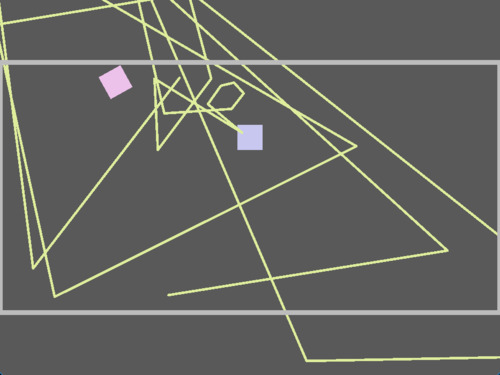
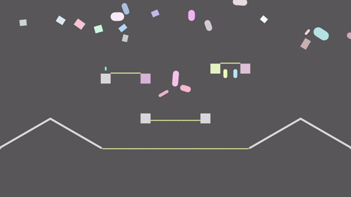

+++
title = "Starframe devlog: Rope physics"
draft = true
date = 2021-10-26
slug = "starframe-ropes"
[taxonomies]
tags = ["starframe", "physics"]
+++

[Starframe]'s rope physics is the first piece of physics code I've written that
I designed entirely myself. In this post I recount the process that got
me there and the solutions I came up with.

<!-- more -->

## The idea

Having just [implemented XPBD](/blog/starframe-constraints/#extended-position-based-dynamics),
I was thinking about things it's uniquely good at that would also make for
interesting game mechanics. One of the method's big selling points is unified handling
of particles and rigid bodies, which makes coupling between the two relatively
easy to achieve. A rope is one of the simplest constructs you can make out of
particles (check out [this post][sublucid] for some fun interactive examples),
so it didn't take me long to arrive at the idea of connecting bodies together
with ropes. It felt like something that I could pull off technically and
that could also generate a lot of interesting game design.

A rope on its own can be represented as a simple chain of particles with
distance constraints between consecutive pairs of them. I had already
implemented everything required to do this. There are some interesting details
here that I'll get into later, but first, let's talk about the more novel
part — two-way coupling with rigid bodies.

There were two things I needed for the kind of two-way coupling I was looking
for. The first was attaching a rope to a rigid body, which was trivial — in
XPBD, attaching a particle to a rigid body is no different from attaching it to
another particle, which I already did to build the rope itself. The second was
collision detection, which turned out quite nontrivial indeed.

## Experimentation

My initial idea for collision detection was an ambitious one. In order to have
no gaps between particles that things could possibly pass through, I wanted to
connect particles with capsule shapes as illustrated here:

TODO Pictuer

I would first solve the rope's internal constraints on particles, then generate
these capsules and solve collisions on them, and finally reposition the
particles again from the capsules' new positions.

So I got to work. The first step was to implement collision detection for the
capsule shape, since I only had boxes and circles at this point. This was quite
a tricky task in itself and took a few days of intense debugging to get every
edge case right.


The specifics of collision detection aren't important here, but the basic idea
is to treat the capsule as a circle swept along a line segment. This makes it
easy to perform a separating axis test. If that test finds that a collision occurred,
however, we need to find the exact point(s) of contact to be able to do
physics, which is where things get complicated and edge cases start piling up.


Some more tinkering later, I had built a rope out of particles connected with
capsules as described earlier. Code for the particle-capsule coupling had to
be scattered all over the solver, but if it worked it would surely be worth
that complexity. I fired up my testing sandbox and saw a rope that settled
nicely against the side of the box it was hanging from! I then started yanking
it around with the mouse and, well,

It exploded. It wasn't stable. I hoped this might be a bug, but eventually
had to admit it wasn't. What I hadn't considered was that every particle was
part of two different capsules, and if those capsules moved in different
directions, the particle would have two competing positions to choose from. In
some unfortunate configurations this would blow up violently, and there was
nothing I could think of that I could do about it.

### A simpler solution

So I had to admit defeat and toss this capsule idea in the bin. I replaced it
with something much simpler that I knew would be stable — every particle gets
its own collider, no coupling shenanigans at all. A rope is now just a chain of
little circles like this:

TODO pict

This means I had to abandon my grandiose plans of never having gaps in a rope,
but I can compensate by making the particle spacing so small they overlap. I
can't have super stretchy ropes now because stretching creates gaps, but I
can game-design my way around that limitation.


Allowing the colliders overlap meant I needed to make them ignore collisions
with each other. I did this by implementing a layer system similar to Unity's
and assigning all rope particles to a layer without self-collision.
A limitation of this approach is that ropes don't collide with themselves or
each other at all, but this is fine for the game I'm currently working on.


In practice, this turned out to work quite well already. Bodies would slide
along ropes and vice versa in a plausible-looking way. However, stretching
sometimes let bodies wedge themselves between rope particles, stopping them or
making them tumble. I came up with a cheeky little trick to alleviate this —
rather than using the actual collision normal, why don't we now pretend we're
still doing the capsule thing, and use the normal direction of that to move
things apart? Here's a close-up illustration of rope particles colliding with
a box:

TODO picc

The (color?) arrow here is the original normal, which would push the box towards
the other particle. Using the (color?) normal instead pushes the box away from
between the particles much faster.

At this point I was very happy with this solution and couldn't think of
anything to add, so it's finally time to show you a nice flashy gif.


There was also a confusing problem with friction being very strong in one
direction but weak in the other. This turned out to be caused specifically by
static friction, so rather than investigating further, my solution was to turn
static friction off for ropes :)
[A clip demonstrating this on Twitter](https://twitter.com/moletrooper/status/1422609902560849924)


## Other tidbits

- representation in graph
- bending resistance

[starframe]: https://github.com/MoleTrooper/starframe/
[sublucid]: https://zalo.github.io/blog/constraints/#
