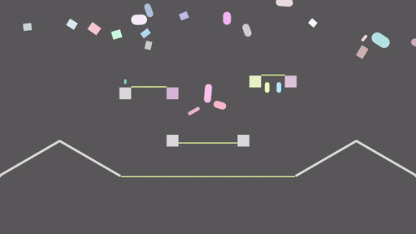
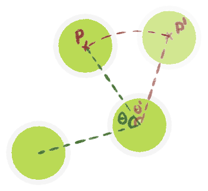

+++
title = "Starframe devlog: Rope physics"
date = 2021-12-30
slug = "starframe-ropes"
aliases = ["blog/starframe-ropes"]
[taxonomies]
tags = ["starframe", "physics"]
[extra]
og_type = "article"
+++

[Starframe]'s rope physics is the first piece of physics code I've written that
I designed entirely myself. This is a short story of that design process
and the challenges and solutions found along the way.

<!-- more -->

## The idea

Having just [implemented XPBD][sf-constraints], I was thinking about things
it's uniquely good at that would also make for interesting game mechanics. One
of the method's big selling points is unified handling of particles and rigid
bodies, which makes coupling between the two relatively easy to achieve. A rope
is one of the simplest constructs you can make out of particles ([this post has
some fun interactive examples][sublucid]), so it didn't take me long to arrive
at the idea of connecting bodies together with ropes. It felt like something
that I could pull off technically and that could also generate a lot of
interesting game design.

A rope on its own can be represented as a simple chain of particles with
distance constraints between consecutive pairs of them. I had already
implemented everything required to do this. There are some interesting details
here that I'll get into later, but first, let's talk about the more novel
part — two-way coupling with rigid bodies.

There were two things I needed for the kind of two-way coupling I was looking
for. The first was attaching a rope to a rigid body, which was trivial — in
XPBD, attaching a particle to a rigid body is no different from attaching it to
another particle, which I already did to build the rope itself. The second was
collision detection, which was a lot less trivial.

## Experimentation

My initial idea for collision detection was an ambitious one. In order to have
no gaps between particles that things could possibly pass through, I wanted to
connect particles with capsule shapes as illustrated here:

I would first solve the rope's internal constraints on particles, then generate
these capsules and solve collisions on them, and finally reposition the
particles again from the capsules' new positions.

So I got to work. The first step was to implement collision detection for the
capsule shape, since I only had boxes and circles at this point. This was a
fairly tricky task in itself and took a few days of intense debugging to get
every edge case right.

Some more tinkering later, I had built a rope out of particles connected with
capsules as described earlier. Code for the particle-capsule coupling had to
be scattered all over the solver, but if it worked it would surely be worth
that complexity. I fired up my testing sandbox and saw a rope that settled
nicely against the side of the box it was hanging from! I then started yanking
it around with the mouse and, well,

It exploded. It wasn't stable. I hoped this might be an implementation bug, but
eventually had to admit it wasn't. What I hadn't considered was that every
particle was part of two different capsules, and if those capsules moved in
different directions, the particle would have two competing positions to choose
from. In some unfortunate configurations this would pull itself into a wall and
blow up violently, and there was nothing I could think of that I could do about
it.

### A simpler solution

So I had to admit defeat and toss this capsule idea in the bin. I replaced it
with something much simpler that I knew would be stable — every particle gets
its own collider, no coupling shenanigans at all. A rope is now just a chain of
little circles like this: ○○○○○○○○○○○○○○○○○○○○○

This means I had to abandon my grandiose plans of never having gaps in a rope,
but I can compensate by making the particle spacing so small they overlap. I
can't have super stretchy ropes now because stretching creates gaps, but I
can game-design my way around that limitation.


Allowing the colliders overlap meant I needed to make them ignore collisions
with each other. I did this by implementing a layer system and assigning all
rope particles to a layer without self-collision. A limitation of this
approach is that ropes don't collide with themselves or each other at all, but
this is fine for my purposes.


In practice, this turned out to work quite well already. Bodies would slide
along ropes and vice versa in a plausible-looking way. However, stretching
sometimes let bodies wedge themselves between rope particles, stopping them or
making them tumble. I came up with a cheeky little trick to alleviate this —
rather than using the actual collision normal, why don't we now pretend we're
still doing the capsule thing, and use the normal direction of that to move
things apart? Here's a close-up illustration of rope particles colliding with
a box:

The red arrows here are the original collision normals, each of which would
push the box towards the other particle. Resolving the collision using the
green normals instead pushes the box away from between the particles faster
and makes it less likely to get stuck.

At this point I was very happy with this solution and couldn't think of
anything to add, so it's finally time to show you a nice flashy gif.


There was also a confusing problem with friction being very strong in one
direction but weak in the other. This turned out to be caused specifically by
static friction, so rather than investigating further, my solution was to turn
static friction off for ropes :)


## Other tidbits

### Bending resistance

If you just connect particles with distance constraints and leave it there,
they can spin around each other without any limits. However, real ropes have
some thickness and rigidity that prevents them from bending to extreme angles.
To this end, I implemented a special angular constraint between three particles.

For each group of three rope particles, I take the angle `Θ` and move the third
particle `P` in a circle until that angle is above a limit value `Θ'`, ending
up with the particle at `P'`. I gave the constraint some compliance ([see my post on
constraints][sf-constraints]) to allow more extreme angles to occur under
pressure. I also added some velocity damping to slow down angular movement,
simulating internal friction in the rope.

This is hardly a realistic model, but I'm making graphics and games here, where
appearance is all that matters. And I generally like how this looks — ropes
tend to move in a pleasantly restrained way, and when bunched up they make
these little bends instead of falling completely flat.

### Data structures


2025 note: I'm not using this entity system anymore —
consider this part a historical curiosity.
There's still a graph structure inside the physics engine,
which allows multiple colliders to attach to one body,
but the rest of the engine uses a regular ECS.


I have this weird entity system I call the Component Graph that I've [written a
bit about before][sf-graph] (though much has changed since). I thought it would
be a fun test of its capabilities to try and represent my ropes entirely in the
graph without any external data structures. This was my first attempt at making
it do something an ECS can't, and led to some pretty fundamental changes to the
entity system itself.


This seemed worth doing because the specialized damping and three-particle
constraints didn't map cleanly onto my existing constraint system. If I was
only doing distance constraints, I would probably have just slapped regular
constraints on pairs of particles and called it a day.


I feel like this post isn't the right place to explain the whole system in
enough detail to understand all the little things I tried and changed.
Consider this a teaser for a deep-dive post on the subject when I have a few
more experiences to talk about ;)


For now, the most comprehensive explanation of the current incarnation of this
system is in the [module documentation in the
source code](https://github.com/m0lentum/starframe/blob/master/src/graph.rs).


Long story short, I ended up changing the whole conceptual model from a
directed graph to an undirected one, added some more explicit control over the
deletion algorithm, made some other unrelated improvements, and ended up with
a rope representation looking like this:

The `Rope` node contains the physical properties of the rope,
and each `Body`-`Collider`-`Pose` triple is a single particle.

This is working pretty well for me so far. It isn't anything you couldn't
implement with, say, an ECS and some external structure to identify rope particles,
but having the entire structure in the entity system gives me some cool
features for free that may or may not otherwise take a bit of thought:

- Rope particles are just bodies with colliders like any other, so all usual
  physics code such as constraints and raycasts Just Works with them.
- On the flipside, you can easily tell if any given body is part of a rope by simply
  checking if it's connected to a Rope component.
- It's trivial to delete an entire rope (and also easy to delete just one
  particle). The graph's delete method handles both cases out of the box.

## What's next

Around this time I also did a bunch of general optimization work (which I'll
write another post about some time). With all this done, I was satisfied enough
with my physics to start working on an actual video game making use of it.
That game is called Flamegrower, and it's about burning some evil alien plants
out of existence. It's open source (though I've yet to figure out exact
licensing) and you can find it (or what exists of it so far) [on
GitHub][flamegrower].

[starframe]: https://github.com/m0lentum/starframe/
[sublucid]: https://zalo.github.io/blog/constraints/#
[sf-constraints]: /blog/starframe-constraints/#extended-position-based-dynamics
[sf-graph]: /blog/starframe-architecture/#attempt-3-graph
[flamegrower]: https://github.com/m0lentum/flamegrower/
