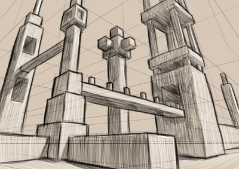
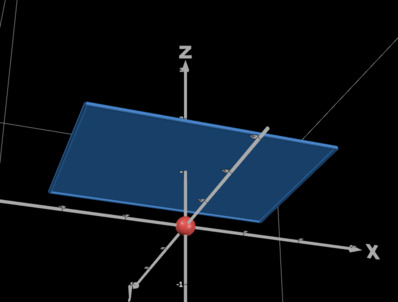
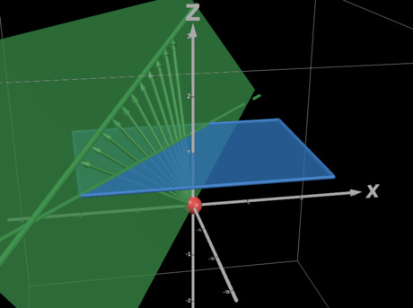
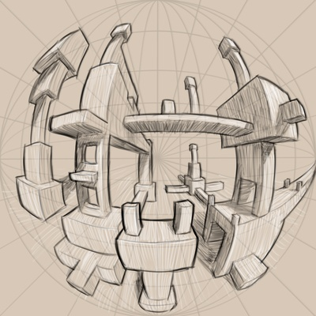

+++
title = "Art rules from first principles, part 1: Perspective"
date = 2025-07-02
slug = "art-rules-perspective"
[taxonomies]
tags = ["art", "geometry"]
[extra]
og_type = "article"
use_katex = true
show_toc = true
enable_webmentions = true
mastodon_url = "https://mastoart.social/@molentum/114784038026370224"
+++

There are many shorthands and rules of thumb
one encounters when learning the fundamentals of representational art —
vanishing points, warm-cool contrasts,
grouping of values into light, midtone and shadow, etc.
There are many good non-technical explanations of these ideas out there,
but I wanted to dive deeper
and investigate how they arise from the physics of light
and geometry of space.
In this first part we'll look at geometric interpretations
of common perspective drawing methods.

<!-- more -->

Perspective is the art of representing three-dimensional space
on a two-dimensional image surface:
the ways in which a picture says "this thing is farther away than that thing".
There are many techniques artists use to communicate distance,
such as overlapping shapes and atmospheric perspective (more on that later in this series),
but when people say "perspective" they're usually thinking about grids and vanishing points.
These are what I want to take a closer look at here.

Let's look at _linear_ perspective first.
If you've ever done 3D graphics programming, this will look quite familiar.

## Linear perspective

The basic rule of linear perspective,
variants of which are one-, two-, and three-point perspective,
is that straight lines are still lines on the canvas,
and lines which are parallel in 3D 
converge at a vanishing point
(as long as they're not parallel with the canvas).
Seems fairly intuitive (why would a line become _not_ a line?),
but let's dig into precisely what this models.

Let's say our eye, represented by the red sphere in the following screenshot,
is a single point in a 3D scene (later referred to as the "observer"),
and our canvas is a flat plane in front of us.
We want to draw what we would see through the canvas if it was transparent.

First, a geometric argument for why lines must remain lines.
For each point on a line in 3D space,
the corresponding point on the canvas plane is found by moving along a line
from that point towards the observer until we meet the canvas plane.
This implies that the resulting curve on the canvas
is the intersection of the canvas plane
with the unique half-plane that contains both the 3D line and the observer
(as long as the line doesn't pass directly through the observer).
The intersection of a plane and a half-plane is, outside of a few specific cases,
a _ray_ (a line segment that is infinite in one direction).


An interactive version of the previous image
can be found in [this Desmos plot](https://www.desmos.com/3d/0eb0500f6f).


This already hints at how vanishing points might arise,
but it's getting complicated to draw.
Let's do a bit of algebra instead.

For ease of notation, let's say we're situated at the origin of our coordinate system
and our canvas is exactly 1 unit away along the z-axis.
Then any point $p = (x, y, z)$ in 3D space gets projected to the canvas
by following the line from $p$ to the origin until we get to the $z = 1$ plane.
Denoting this projection by $P$,
we have $P(p) = (\frac{x}{z}, \frac{y}{z})$.

Now consider what happens to a line under this map.
Define a line through $p = (x, y, z)$
with direction $\hat{d} = (x', y', z')$,
containing all points $l(t) = p + t\hat{d}$, $t \in \mathbb{R}$.
The projection of this line onto the canvas is
$$
P(l(t)) = \Big(\frac{x + tx'}{z + tz'}, \frac{y + ty'}{z + tz'}\Big).
$$
If $z' = 0$, then the line is parallel with the canvas and,
as expected, can have any direction vector in the canvas,
thus not being bound to vanishing points.
Otherwise, it's not immediately obvious what this curve looks like,
but we can reparameterize it as follows:
Since $l$ must now intersect with the $xy$ plane,
let's shift the starting point such that $z = 0$
and orient $\hat{d}$ such that it points
from there towards the canvas (i.e. $z' > 0$).
Then
$$
P(l(t)) = \Big(\frac{x + tx'}{tz'}, \frac{y + ty'}{tz'})
= \Big(\frac{x}{tz'} + \frac{x'}{z'}, \frac{y}{tz'} + \frac{y'}{z'}\Big)
$$
From this form it becomes clear that this is indeed still a line:
a constant point $(\frac{x'}{z'}, \frac{y'}{z'})$
plus a vector $(\frac{x}{z'}, \frac{y}{z'})$ times a scalar $\frac{1}{t}$.
Furthermore, the roles of $p$ and $\hat{d}$ are reversed:
the constant point depends only on $\hat{d}$!
From this it follows that all lines with the same direction vector $\hat{d}$
meet at this point.


This one is from [another Desmos plot](https://www.desmos.com/3d/54ef687d08).


This even gives us an explicit formula for the location of the vanishing point!
The formula matches intuition nicely —
lines that face directly away from the observer (i.e. $\hat{d} = (0, 0, 1)$)
meet at the origin of the canvas plane (a common one-point perspective setup!)
and as $z'$ gets closer to zero,
the corresponding vanishing point gets farther and farther away
until it disappears off to infinity when the direction vector
becomes parallel with the canvas plane.


If we think about the canvas plane as the extended plane
$\mathbb{R}^2 \cup \{\infty\}$, also known as the _Riemann sphere_,
where $\frac{1}{0} = \infty$,
we can say _all_ lines have a vanishing point
defined by $(\frac{x'}{z'}, \frac{y'}{z'})$!
Completely useless knowledge in this context, probably, but fun.


On a physical canvas, the placement of vanishing points depends on the field of view.
This is controlled by the area of the infinite canvas plane that we choose to display —
the page we draw on maps to a rectangle in the plane,
and the larger the rectangle, the wider the field of view.

Thus we've shown the two main rules of linear perspective:
lines stay as lines, and when not parallel with the canvas they meet at vanishing points.

One-, two-, and three-point perspective are derived from this principle
by assuming that lines in the scene only go in one, two, or three different directions
which aren't parallel with the canvas.
This is enough to draw a cube,
but in most real-life scenarios there are lines in many more directions
and thus many more (all the way up to an uncountably infinite number, in fact)
vanishing points.

## Curvilinear perspective

As noted in the previous section,
linear perspective treats the image surface as a plane in 3D space.
This is a good approximation of human vision when the field of view is narrow,
but the wider you make it, the more you get distortions around the edges
(imagine bringing the image plane illustrated in the previous section
right up to your face and looking towards its edge —
it'll be much farther away from you than the middle).
A common alternative enabling a wider field of view
is so-called five-point perspective,
in which lines in 3D space become sections of an ellipse on paper.

The grid setup of five-point perspective is as follows.
Draw a point at the halfway point of each edge of your page
and one more in the middle.
Connect the top and bottom points with ellipses,
and do the same for the left and right points.
Finally, draw lines radially outward from the center point.

These are the grid lines
corresponding to the three principal axes of your 3D scene:
Vertical lines follow the vertical ellipses,
horizontal lines follow the horizontal ellipses,
and lines facing directly away from you
follow the radial lines towards the center.
There are no other vanishing points besides these five in this setup:
lines that aren't parallel with the principal axes don't converge at a point at all.

The outcomes of this setup resemble photos taken with a fisheye lens,
so one option to investigate its geometry would be to look into lens optics.
I won't go there today, though;
my interpretation here is based on a projection directly to an image surface,
analogously to what we've already seen in linear perspective.
I believe a similar geometric model is how this is often taught to artists,
but I'll make it much more mathematically precise here.

Suppose that we are, again, at a point in space
and things we see are projected towards us along lines.
This time, instead of taking our image surface to be a rectangular piece
of a plane in front of us, make it a _hemisphere_ instead.


All pictures in this section are from [this Desmos plot](https://www.desmos.com/3d/cwopgbclx6).


Assuming again that our eye is at the origin of our coordinate system
looking in the +z direction,
and also that our image sphere has unit radius,
the projection map taking points in 3D space to the sphere
simply normalizes the points: $P(p) = \frac{p}{||p||}$.
By the same geometric argument made in the previous section,
the image of a line under this map is the intersection
of the sphere with the unique half-plane containing the line and the observer.
Since this plane passes through the center of the sphere,
the resulting curve is half of a _great circle_.

Furthermore, when the line is horizontal (aligned with the x-axis),
the projected great semicircle always touches the points $(\pm 1, 0, 0)$
where the sphere intersects with the x-axis,
and vertical lines similarly meet at $(0, \pm 1, 0)$.
Finally, lines facing directly away from the observer project to 
great semicircles that end at $(0, 0, \pm 1)$,
which is the center of our image surface.
These are precisely the vanishing points of five-point perspective!
Here's an entire perspective grid drawn on the hemisphere:

One more thing is unclear, though.
We're drawing on a flat page, not a hemisphere!
It's not at all obvious how one would map to the other.

There is no _isometric_ map from the sphere to the plane,
so we can immediately rule out any possibility
of keeping all distances and angles as they appear on the sphere.
(If this was possible, cartography would be a whole lot simpler!)
We need a projection that somehow retains the illusion of looking through a sphere.
One important aspect of this is radial symmetry,
a property of [azimuthal projections].

All of the azimuthal projections in Wikipedia's examples look more or less
like what we're looking for,
so I tried a few of them (specifically Lambert equal area,
orthographic, stereographic, and equidistant) in my [Desmos model](https://www.desmos.com/3d/cwopgbclx6)
to see what they do to the great semicircles that form our perspective grid.
To arrive at a suitable interpretation of five-point perspective,
I need to see half-ellipses and radial lines,
which turned out to be the case with all of them.
Only the spacing changes with the choice of projection.
Thus all of these projections are in some sense correct for the purposes of this analysis,
since in a drawing we can change distances in whatever way feels right.
I'd speculate that in most cases the equidistant projection,
for which distances from the center of the page are accurate,
is the closest thing to what an artist is trying to do.


The insight gained from just projecting perspective grids is admittedly incomplete.
It would be a fascinating programming exercise to implement each projection in code
and see how a 3D scene looks with them,
but that's more effort than I'm willing to put into this post 😅


The corners of the page outside of the outermost circle
are typically left empty in drawings.
This makes sense because, depending on the chosen projection,
these areas either don't have any meaning
or represent a heavily distorted view _behind_ the observer,
which we'd rarely want to depict.

We've assumed a square canvas here,
which is what you usually see with five-point perspective.
There are two different ways to adapt this technique and analysis
to a canvas with a different aspect ratio.
First, if we simply place the vanishing points on the edges of a non-square canvas
and do the rest of the setup as before,
this corresponds to squashing the spherical image surface into an ellipsoid.
On the other hand, we could place vanishing points off the page
such that they still form a square,
which corresponds to cutting off part of the surface.
The latter option also allows us to "zoom in":
if we move the vanishing points away from the page,
we can create a less distorted image with a narrower field of view.

## Conclusion

We've now seen how perspective drawing
can be modelled by mathematical projections —
linear perspective by projection directly to a plane,
and curvilinear by projection to a sphere and from there to a plane —
and how these lead to the vanishing point setups we see in drawings.
I have no idea how useful any of this is to the average person,
but writing it certainly helped me understand in much greater depth
what I'm doing when I draw.

As the title suggests, this post is planned to be the first part of a series.
The rest of it will be about color theory and the physics of light.
No promises as to when it will be coming out, but stay tuned!

[lambert azimuthal projection]: https://en.wikipedia.org/wiki/Lambert_azimuthal_equal-area_projection
[azimuthal projections]: https://en.wikipedia.org/wiki/Map_projection#Azimuthal_(projections_onto_a_plane)
