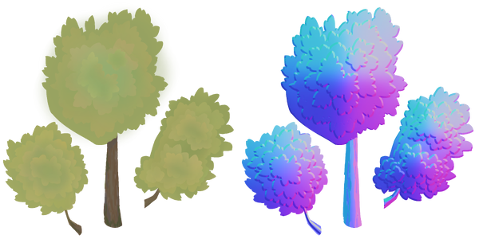

+++
title = "Game graphics: the journey so far"
date = 2025-01-19
slug = "game-graphics"
[taxonomies]
tags = ["starframe", "graphics", "art"]
[extra]
og_type = "article"
show_toc = true
+++

The majority of my recent game development work
has revolved around graphics —
both workflows for making them
and technology for rendering them.
Many ideas have been had and many scrapped along the way,
and the journey certainly isn't over yet,
but I think I'm moving towards something pretty unique and cool.
This is a devlog-style post where I meander through
some of the more noteworthy moments so far
without going very deep into technical details
(but providing technical sources where relevant).

<!-- more -->


This covers a time period of about two years, starting in 2022,
of intermittent work between art projects.


## Initial ideas

To begin to narrow down the infinite space of possible art styles
and technical implementations,
there are a few different factors I was considering.
First of all, the games I want to make are sidescrolling 2D platformers,
which imposes a certain perspective and loose archetypes of graphics assets needed.
The most important constraint, though,
is that I need a process that takes little enough work
to feasibly make a game by myself.

This is where many solo devs turn to pixel art —
with a sufficiently limited resolution and palette,
you can make some pretty nice-looking art very quickly.
You can also get away with low temporal resolutions and animate just a few frames.
It's hard to beat that value proposition when it comes to sheer efficiency,
but there's one glaring problem:
_I don't particularly enjoy making pixel art_.

The obvious next choice after taking pixel art off the table would be
to simply crank up the resolution,
making digital art with more traditional styles of drawing and painting.
That sounds much more fun to me,
but I'm concerned about the work required
to draw my animations frame by frame.
I'm not an experienced animator,
so I could really use the efficiency of 3D keyframe animation
to learn and experiment.
Plus, just rendering sprites is kind of boring from a technical point of view —
I'd like to flex my graphics programming muscles with this too.

Full 3D is too much work in a different direction, though.
Animating 3D models is efficient, but making them is loads of work.
Perhaps I could do something in a low-poly style,
but I want to incorporate drawing too,
so I decided restrict myself to 2D solutions with keyframe animation.
The closest thing to a standard tool in this space as far as I'm aware is [Spine],
but I'd prefer to stick with open-source software,
so at this point the decision was made to make stuff in [Blender]
and roll my own rendering tech.

## Attempt 1: Pseudo-low-poly

"Make stuff in Blender" could still mean just about anything
as far as style goes.
I was looking to make something simple and efficient,
and the idea of low-poly was still in my head,
having just decided against doing it in 3D.
What if I made low-poly-style graphics in 2D:
polygon meshes with flat colors?
I drew this piece of concept art,

{{ fit_img(width=500, height=500,
alt="Stylized portrait of a woman wearing a dress with an apron
and some gardening tools hanging on a belt."
src="/blog/2025/game-graphics/character_concept.jpg"
)}}

which I turned into a 3D model in Blender by tracing over the vertices
and using vertex painting to match the colors.
This way I wouldn't need any textures,
making the rendering part of the technical implementation as simple as it gets.


This character is the protagonist of Flamegrower,
a physics-based platformer I'm very slowly working on.
The narrative of the game has since shifted quite a bit,
and her design with it, turning her from an android gardener
into [Ivu the dryad](/gallery/2024/ivu/).



The outlines were to be rendered using the jump flood algorithm,
which I had already implemented for fun based on [this blog post by Ben Golus](https://bgolus.medium.com/the-quest-for-very-wide-outlines-ba82ed442cd9).
This code eventually got deleted,
but it was a fun little project while it lasted.
Funnily enough, I would later implement and scrap the same algorithm again,
this time in the context of Radiance Cascades.


I animated a quick walk cycle for the model,
exported it into the glTF format,
and wrote an importer to load the data into [Starframe].
Next followed the long and arduous coordinate-space-wrangling trial
that is implementing skinned mesh animation.


The "bone structure" that controls an animation is called a _skin_
in glTF parlance (Blender calls it an _armature_).
If you're curious about the math involved,
the [glTF tutorial](https://github.com/KhronosGroup/glTF-Tutorials/tree/main/gltfTutorial)
has a [page](https://github.com/KhronosGroup/glTF-Tutorials/blob/main/gltfTutorial/gltfTutorial_020_Skins.md)
about it.


After many scratches of the head and eldritch bugs,

{{ fit_img(width=500, height=500,
alt="Character rendered wrong, with the face appearing on the chest
and limbs off their joints."
src="/blog/2025/game-graphics/skin_bug.jpg"
)}}

I had my first prototype running.
Then I started working on my master's thesis and dropped the project for a year.

## Attempt 2a: Getting lit

Naturally, after a year away from the project,
I came back with some different feelings and new ideas,
extremely vulnerable to being [nerdsniped][nerdsnipe]
into a pivot to something completely different.
I was thinking about lighting and sketched this mockup of a gameplay situation:

{{ fit_img(width=800, height=800,
alt="A sunlit outdoor scene with a windmill and a rocky cave
in the foreground and rolling hills with trees in the background."
src="/blog/2025/game-graphics/level_mockup.jpg"
)}}


The dark flats in the foreground were directly inspired by
[The King's Bird](https://store.steampowered.com/app/812550/The_Kings_Bird/),
which I consider the prettiest game ever made.


Something like this could be implemented by just manually painting the light
onto textures, but wouldn't it be cool if it was dynamic and changed over time?
Also, fire is a major mechanic in this game,
so it would be sick as hell if burning stuff also cast light on the scene.
Lighting as shown in the mockup, though, where it indicates 3D forms
by taking into account the direction a surface is facing,
requires knowing said direction.
I would need a [_normal map_][normalmap].

I don't have access to any of the usual 3D tricks for making normal maps
(i.e. sculpting a higher-resolution model and "baking" down the details),
so I would need to paint one by hand, which seems tricky.
I had looked into this a little bit before out of curiosity,
but the only techniques I'd seen involved meticulously picking colors from a reference sphere,
which seemed like a lot of work.
I decided to try it anyway to see if it was actually that hard.

Turns out I wasn't the first to want to do this.
Digging into [Krita]'s features I discovered
an entire [brush engine][nm-brush-eng] dedicated to normal maps,
as well as helpful filters and blend modes
for combining layers in a sound way,
making sure you have a valid normal map by normalizing the colors,
and even testing its effect with a simple [Phong lighting model][phong]
right there on the canvas.
The brush engine is amazing — if you have a tablet with a tilt sensor,
you can "sculpt" normals by tilting your stylus
in the direction you want the surface to point.
I actually purchased a new tablet with a tilt sensor just to try this,
and I'm glad I did, because it ended up transforming my general painting process
for the better in many more ways than expected.


I have [another post here](../krita-tips/) going into detail
about the painting process for these normal maps,
along with general digital painting tips.


Here are the first textures painted with this process:

I assembled these into a model in Blender,
animated it swaying in the wind,
and set out to write a rendering engine that would make use of the normal map
(and support textures, which the previous approach didn't need).

Long story short, I went to [LearnOpenGL][learnogl]
(a great learning resource for beginners even if you're not using OpenGL —
I'm using [wgpu], personally),
read the chapters on [normal mapping][learnogl-normal] and [deferred shading][learnogl-deferred],
and built a pretty standard 3D renderer
that supports directional lights and a large number of point lights.


More on deferred shading, and why it wasn't a great choice after all,
in the next section.


Here's what that tree looked like in-engine
(with a directional light as a sun, and with point lights centered on physics objects):

Not too shabby! The illusion of 3D form is certainly there,
and moving the lights around looked pretty cool.
I then set out to try this process and technology with a larger piece of artwork,
titled [Don't forget to charge your moon staff](/gallery/2024/moonstaff/):

The light's effect is very subtle here —
the moonlight is hand-painted directly into the texture,
but the character has a normal map and gets extra light
from the particles as they approach.
I was very happy with how this came out,
but I noticed some problems with the deferred shading approach
that made it suboptimal for this art style.


I also developed a line renderer for this based on [these](https://wwwtyro.net/2019/11/18/instanced-lines.html)
[blog posts](https://wwwtyro.net/2021/10/01/instanced-lines-part-2.html) by Rye Terrell,
adapted from one I had written earlier for [dexterior](https://github.com/m0lentum/dexterior)
(a cool simulation and visualization library I'm making for my PhD research;
perhaps a topic for another day).
For this piece I added support for translucently textured lines,
which turned out quite tricky to do.


## Attempt 2b: Defern't

To understand why deferred shading wasn't all that
and what I did instead, we need to get a little more technical.
So very briefly, deferred shading in a nutshell
(see the [aforementioned LearnOpenGL article][learnogl-deferred]
if you want to get into the weeds on this):

Problem: Computing lighting can be pretty expensive when you have a lot of lights.
If you're drawing a lot of triangles,
many of them will end up covered behind other triangles
and thus not displayed on the screen.
If you compute lighting immediately when drawing each triangle,
you'll waste time lighting stuff that never ends up on screen.

Solution: don't do that!
Instead, in the first pass, store all the variables you need to compute the lighting
(position in space, normal, color, ...)
into a bunch of screen-size textures called g-buffers.
Then take the g-buffers and compute the final lighting from their contents.
This way you only need to compute lighting once for each pixel on the screen.

A consequence of doing things this way is that deferred shading
_cannot render transparent things_
because every pixel on the screen must
have one position, one color, one normal, and so on.
It's either full opacity or none, making every edge between layers a sharp cutoff.
This is a huge limitation in a hand-painted style like this,
best illustrated by the edges of these clouds,
which have a pre-baked blur effect on them to emulate depth of field:

The outcome of deferred shading is on the left,
with what I'd like to see instead on the right.
What's supposed to be a blur is a jagged halo in the deferred version,
because the color that should fade into transparency
is instead rendered at full opacity wherever the texture contains any color at all.
The same issue appears more subtly at every edge between different textures,
because digital painting brushes apply anti-aliasing on edges using transparency.
Not to mention that if I wanted something entirely translucent
such as stained glass or thin fabric, I'm out of luck.
Back to the drawing board it is, then.


Deferred shading also has some performance issues
due to the high memory cost of g-buffers.
Its benefit is the ability to have lots and lots of point lights
in a complicated scene, but in hindsight that was not my use case at all,
so I was just getting hit with all the downsides
without making use of the advantages.



Oh, and you can't do MSAA with deferred shading either,
which isn't that big of a deal with this style,
but another reason to prefer something else.


The alternative is, quite simply, do what deferred shading tries so hard not to do —
compute lighting immediately when drawing each triangle —
but be smart about it.
Drawing everything right away without all that deferred nonsense
is called _forward rendering_,
and, as expertly foreshadowed by that comparison image earlier,
one of the ways to be smart about it is called [_forward+_][forwardplus],
which utilizes two different ideas to make things efficient.
Again, the [paper][forwardplus]'s there if you want the full story,
but let's take a quick look at how it works.

The first trick to avoiding unnecessary work in forward+ is the _depth prepass_,
which bears some resemblance to deferred shading.
Instead of writing to a bunch of g-buffers, though,
we just draw all opaque objects to one depth buffer.
This way we know where the nearest opaque surface is on each pixel on the screen,
and when we get to the actual shading pass we can skip pixels that won't be seen.


The depth buffer is a standard graphics technique that is pretty much always used in 3D;
the only thing special here is drawing depth and _nothing else_ first.


The second trick, and forward+'s main contribution,
is how we handle having lots of lights in the world.
We divide the screen into little squares,
and for each square we allocate a bin
where we mark which lights can reach pixels in that square.
This is done with a compute shader _after_ the depth prepass,
so that we can use the depth information
to rule out lights that are too far in the z direction.
When shading a pixel, we can now check its corresponding bin
and only consider lights that actually have an effect.


Doing lighting with a 2D grid of bins like this is also known as _tiled_ shading.
You could also have a 3D grid with several layers in the z direction,
which is called _clustered_ shading.
The latter works better if you have transparent objects that need to be lit,
which I didn't realize until after this whole thing was already obsolete 😅


Now we're ready to draw.
To get transparency right, we need to draw the most distant objects first
(barring fancy order-independent transparency algorithms,
which I have no experience with), though.
So the steps of this renderer are as follows:
1. Sort objects by depth
2. Draw opaque objects to the depth buffer
3. Compute light bins
4. Draw everything, ordered from back to front,
  with alpha blending enabled to handle transparency

Now we've got something that does justice to my art style
(refer back to the comparison image earlier)!
Transitions between layers look exactly like they do when I'm drawing in Krita.
Implementing this was a lot of fun —
I learned to write compute shaders
(a tremendously useful tool which I also used
to massively speed up my animation computations),
and the fact that my world is 2D enables a variety of fun trickery.
For instance, the tiles for the light bins are just cuboids,
where in standard 3D they're perspective-warped into frustums,
and depth sorting is greatly simplified.


I'm tempted to explain more about these 2D tricks because this stuff is fun,
but I promised to be light on the technicality
(which I've arguably already failed at)
and this post is probably long enough without it.


This was very cool and all,
but alas, having something that works pretty nicely
doesn't do anything to immunize me against nerdsniping.
Time for another big pivot.

## Attempt 3: My radiance, it's cascading

One fateful day, YouTube recommended me [this video by SimonDev][simondev-rc]
about a new lighting algorithm called Radiance Cascades (RC).
I couldn't stop thinking about it,
so I set out to see if I could implement it.
It turned out I, in fact, could.
The method is full of subtle details that I won't even attempt to explain here,
but let's take a brief look at what it does
and what I did to adapt it to my purposes.

For further reading, the sources I used for my implementation
were [the original paper][rc-paper] by Alexander Sannikov
and [these][gmshaders-rc-1] [posts][gmshaders-rc-2] by Yaazarai.
I've also seen [this newer post by Jason][jason-rc]
and [this one by MΛX][max-rc] recommended.
It's an active research topic
and new stuff gets written and invented all the time.

First of all, this method does _global illumination_,
which simply means that every point in space can emit or block light.
That implies that lights can have any shape, and they cast soft-edged shadows.
So the basic problem is to measure incoming light (_radiance_ in radiometric terms)
from every direction at every point in space.
That's a lot of computing to do!
RC makes this tractable with a clever decomposition of space into a hierarchical structure,
constructed in a cascading fashion from top to bottom.
Hence the name Radiance Cascades.

The structure consists of probes
that cast rays into the surrounding environment to find lights.
Without going into specifics (see the sources linked above for that),
the end result is a grid of probes
that contain approximations of incoming radiance from a set of directions.
When rendering, we can then find the nearest probe
and use its radiance values to compute lighting.

It took me a couple of weeks to get a baseline prototype running,
which looked like this:


This is an entirely 2D algorithm without any notion of a z direction,
so it's not at all obvious how to apply
a normal map like I did here with the background trees.
I don't know of any standard ways to go about this,
so I derived my own method based on subdividing a sphere,
which was a fun exercise.


There's one big problem here when it comes to my art style:
things that cast shadows are completely black.
This is because in the most commonly seen implementations of the algorithm,
everything is fully opaque, and thus all light gets blocked
the moment a ray hits anything.
I tried to find ways around this by modifying when exactly a ray gets blocked,
but nothing worked.
Eventually I decided to change my approach entirely —
what if, instead of being opaque, everything was translucent?
I hacked together an experiment with volumetric raymarching
(the fancy name for tracking rays through translucent materials),
which looked like this:

This is already much more interesting —
you can see details on the shadow-casting objects too.
However, the math in this was completely made up and not remotely physically accurate,
so I took a dive into the academic field of _radiative transport_
(specifically the book _Volume Rendering - Mathematical Models and Algorithmic Aspects_
by Hege, Höllerer & Stalling)
to figure out how to do this properly.


A nice side effect was that this was also significantly faster
than my previous solution, which made it no longer a concern
whether or not I could get this to run in real time.


After getting the physics right and adding an _environment map_
for image-based lighting,
which allows light of a simulated sky to come in from off-screen,
we arrive at the present-day version of this system.
Here are a few screenshots of it:

"Sunset" environment lighting.
Notice the blue tint on the shadow, created by the blue light of the sky above.

Various lights and trees at night.
Notice the much sharper-edged shadows
compared to the physically nonsensical first attempt.

"Day" environment lighting.


These scenes have a white back wall to make the light as apparent as possible.
It looks a bit incongruous with the trees,
but in real projects those will obviously get a better-fitting context around them.


This renderer is not entirely done yet,
and I haven't quite figured out how to design graphics that look good with it,
but I'm really excited about where it's going.
If you'd like to see it in action on your own computer,
check out [Velgi], a jam game I made to test out the current feature set.

## Conclusion

A lot of code was left behind along the way,
but none of these attempts were useless —
obviously they all taught me something,
but all of them also directly contributed features to the final product.
The low-poly idea didn't end up being the art style I wanted,
but the glTF importer and animation code I wrote for it still works now.
The normal map painting workflow I came up with after that
is still part of my art style of choice,
and the depth prepass plus alpha-blended layering of forward+
is still the general structure of the renderer today,
only with tiled shading replaced by Radiance Cascades.

It occurred to me while writing this post
that the process I went through with graphics
was almost exactly what happened with physics before
(some of that documented in [this excessively long post](/blog/2021/starframe-constraints/)) —
I tried a few standard techniques,
then stumbled upon a cutting-edge method on social media
at a time when I was just skilled enough to implement it,
and ended up with something kind of novel.
I suppose it's a good learning process,
although I could really use a more reliable method
for the part where I randomly come across new research on social media...
Maybe I'll figure that out in my PhD studies.

[spine]: https://esotericsoftware.com/
[starframe]: https://github.com/m0lentum/starframe
[nerdsnipe]: https://xkcd.com/356/
[normalmap]: https://en.wikipedia.org/wiki/Normal_mapping
[krita]: https://krita.org/
[blender]: https://www.blender.org/
[nm-brush-eng]: https://docs.krita.org/en/reference_manual/brushes/brush_engines/tangen_normal_brush_engine.html
[phong]: https://en.wikipedia.org/wiki/Phong_reflection_model
[wgpu]: https://wgpu.rs/
[learnogl]: https://learnopengl.com/
[learnogl-normal]: https://learnopengl.com/Advanced-Lighting/Normal-Mapping
[learnogl-deferred]: https://learnopengl.com/Advanced-Lighting/Deferred-Shading
[forwardplus]: https://takahiroharada.wordpress.com/wp-content/uploads/2015/04/forward_plus.pdf
[simondev-rc]: https://www.youtube.com/watch?v=3so7xdZHKxw
[rc-paper]: https://drive.google.com/file/d/1L6v1_7HY2X-LV3Ofb6oyTIxgEaP4LOI6/view?usp=sharing
[gmshaders-rc-1]: https://mini.gmshaders.com/p/radiance-cascades
[gmshaders-rc-2]: https://mini.gmshaders.com/p/radiance-cascades2
[jason-rc]: https://jason.today/rc
[max-rc]: https://m4xc.dev/articles/fundamental-rc/
[velgi]: https://molentum.itch.io/velgi
