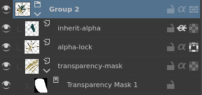
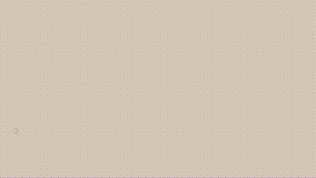
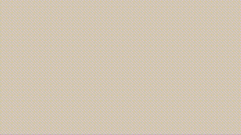
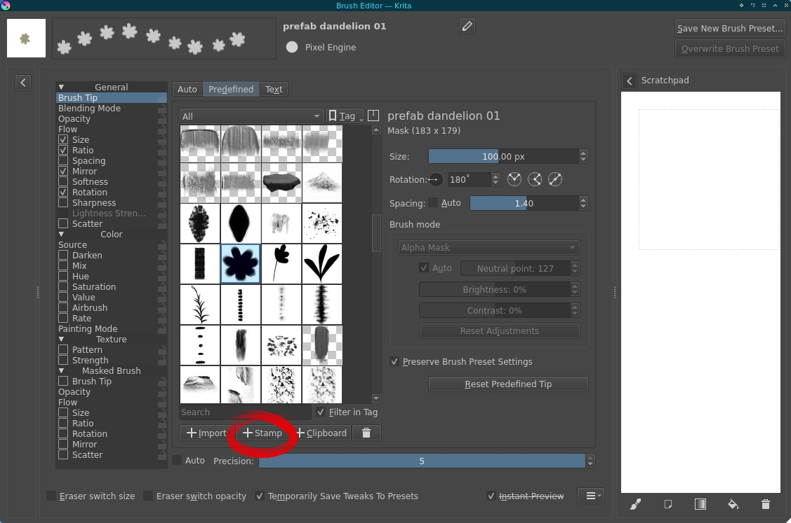
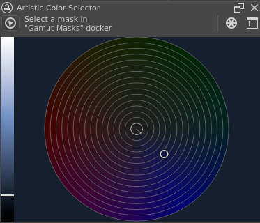

+++
title = "Painting normal maps, and other Krita tips"
date = 2025-02-01
slug = "krita-tips"
draft = true
[taxonomies]
tags = ["art"]
[extra]
og_type = "article"
+++

I'm a big fan of using software effectively and optimizing my workflows,
so over my years using [Krita] I've spent quite a bit of time digging into its features.
In this post I want to talk about how I use this wonderful piece of software
and highlight some not-so-obvious bits
that have made a difference in my process.
I'll do general painting first, hopefully in a way that is useful to beginners,
and then indulge in some nerding out about normal maps and how to make them.

<!-- more -->


As the title suggests, I'll only talk about Krita in this post,
but I'd expect most of these features to have analogues
in most other painting programs.
The latest Krita version at the time of writing was 5.2.6;
time-travelling readers on much later or earlier versions
may find some differences to their setup.


## Part 1: General painting

Alright, let's get into it.
This section is a loosely categorized collection of tips
in no particular order.

For more information on everything mentioned here and more,
as well as more in-depth tutorials about some general techniques and concepts,
I'll refer you to Krita's excellent and extensive [documentation][docs].

### Settings and shortcuts

One of the first things I do with any software I intend to spend a lot of time with
is familiarize myself with the settings, especially the keyboard shortcuts.
I highly recommend customizing the shortcuts to bring all the tools you use frequently
close to the left-hand home row for quick and easy access.

A particularly cool part of the shortcuts is the "canvas input settings" submenu.
It contains keyboard inputs that interact with your mouse/stylus in some way,
such as panning, zooming, or changing the brush size with a gesture,
picking the color under your cursor, etc.
One of my favorites is the "select top layer" shortcut,
which selects the topmost layer that contributes to the pixel under your cursor.
This way I can organize my work with layers
without having to manually fumble with the layer menu
whenever I move to a different part of the image.

Another menu you should look at is the Dockers dropdown under Settings —
there are some nifty things hidden there
(more on some of those later).
And speaking of dockers (those are all the widgets left and right of the canvas),
you can move them around and customize the interface,
which can go a long way to improve your workflow.
Here's a screenshot of my painting workspace for reference:

I use the color picker and brush selector the most,
so those are closest to the bottom right where my stylus hand
can reach the most easily.


You can also save and switch between workspace layouts
in the menu at the top right corner.


### Layers

Layers have lots of uses, some organizational, others for various effects.
I like to organize my layers such that I can easily navigate them
with the aforementioned "select top layer" shortcut,
which in practice means doing one "part" of the image per layer
(whatever that means for the subject)
and adding overlay effects last in the process,
as these would otherwise be picked up by the shortcut.
How many layers depends on how much effort I plan to put into the image
and how confident I am about getting it right in one go —
layers make it much easier to edit parts of the image without disturbing others,
but they also take some effort to maintain.

The effects that layers can do are plentiful.
Here's a list of some that I like:

- Layers as stencils: limit where paint can go on a given layer.
  There are a few ways to do this:
  - Alpha lock: you can only paint over whatever is currently opaque on this layer.
    I use this one the most.
  - Transparency mask: a separate mask attached to a layer
    that decides which parts of the layer are visible.
    Paint on the mask with black and white to control what is shown.
    Create with `right click -> Add -> Add Transparency Mask` in the layer menu.
    (tip: if you've made a selection with e.g. the lasso tool
    and then add a transparency mask,
    that selection automatically becomes the shape of the mask)
  - inherit alpha: Only display parts of the layer that are on top of
    other layers in the same group.
  
- Blend modes: alter the way color on a layer interacts with the layers below it.
  I'm not a fan of using these for basic things like shading,
  but they're great for effects and final adjustments.
  See the [docs][docs-blend] for an illustrated list;
  some I use a lot are
  - Soft light: subtle light effect that saturates colors; nice for bloom.
  - Addition: a physically-plausible way to quickly add stronger lights.
  - Multiply: a quick way to darken shadows.
- Fill layers
  - A classic trick to add texture at the end of a painting is to add a low-opacity fill layer
    with a paper or noise texture. This makes color transitions appear less uniform
    and creates a more "traditional" feeling, especially if using low-texture brushes.
    Soft light or Overlay is usually a good choice of blend mode
    to avoid colors getting altered too much.
  - Add a black fill layer with the Color blend mode
    to quickly check how your work looks in grayscale.
  - (The effect of a fill layer can also be achieved with a normal layer and the fill tool,
    but a fill layer has some advantages: it's easier to adjust afterwards
    and responds automatically to changes in canvas size.)
- Filter layers: a non-destructive way to add a filter
  (i.e. does not alter any of your existing layers,
  unlike if applied from the Filter menu),
  which you can adjust or remove later.
  I often use this to add a blur over distant parts for a depth-of-field effect.
- Vector layers: when you want particularly precise geometric shapes,
  these can be really handy.
  Gives you a similar path editing tool to what you'd find in a vector editing program like Inkscape.
  You can also alpha-inherit a regular layer to one of these to paint on top of the vector shapes.
- Layer styles: there are some neat effects here
  that typically do something around the edges of a layer,
  such as drop shadows and glows,
  useful especially for styles with clean graphic shapes.
  You can apply them to groups of layers too,
  e.g. to put an outline around a character composed of many layers.


Each of these special types of layer can be created via the little dropdown arrow
next to the "new layer" button,
or with keyboard shortcuts (which aren't configured by default).
Layer styles are in the right-click menu of an individual layer or group.


### Brushes

I don't want to overstate the importance of brushes —
it's a common beginner trap to search for good-looking brushes
instead of training the fundamentals that will enable you to make any brush look good
and to make informed choices about which brushes you want to use.
Besides, the default brushes in Krita are great!
I used them for years before I went looking for anything else.
That being said, I want to call attention to one feature in particular
that is missing from the default brush set: _tilt_.


This is not something every tablet out there can do, unfortunately,
so if you're on a budget you may not have access to it.
I recently bought a new tablet specifically for this feature
(mine is a Wacom Intuos Pro Medium; look for "tilt recognition" or similar in the feature list).


First, shoutout to [Rakurri's brush pack][rakurri-pack],
which I found when searching for information on how to make use of tilt.
Most of my current go-to brushes are from this pack with minor modifications.
There are two main ways tilt is utilized in these brushes.
On the one hand, you can use the amount of tilt to change the size of a brush
(imagine tilting a pencil to get a wider, softer line),
which is great because you can seamlessly work on multiple scales at the same time.

Even more impactful is the ability to control brush rotation with the tilt direction.
This enables an entire world of asymmetrical brushes,
such as this one mimicking a traditional flat brush.

These are just two of the most prominent examples —
tilt angle and direction can be mapped to just about any brush property,
so your imagination is the limit
if you decide to dive into the brush editor yourself
(which I highly recommend you do at some point).

Another way I use tilt (although it's by no means necessary for the basic idea)
is in what I call _prefab brushes_.
The idea is that when I want to repeat something small a lot,
instead of copying and pasting,
I turn it into a brush.
This can be done quickly as follows:
1. make a new layer
2. draw the thing you want to repeat in black
3. right-click the layer -> "Select Opaque"
  (without a selection the brush will contain the whole image)
4. go to the Brush Tip section of the brush editor
  and click the Stamp button

Technically that's all you have to do to make a brush like this,
but there are things you can do to make it nicer to use and add some variation.

For one, you can randomly vary the size and rotation of the brush a bit
by adding a Fuzzy Dab component to those features.
The rest of what I do relies on tilt —
I set the `Rotation` of the brush by tilt direction
(just like that bristle brush earlier),
and for some prefabs I also control the `Ratio` by tilt angle
such that tilting more squishes the prefab as if in perspective.
Also, for some plants and such I add a `Mirror` modifier depending on tilt direction
such that when I tilt up, I get the plant facing left,
and when I tilt down, I get it facing right.


Notice how I can now pick whatever color I want!
This is both an advantage and a limitation —
the whole prefab must be one color for this to work well.
That's one of the reasons why I only use this technique for small details.


If you want to try this and need more details,
I've included a couple of examples you can build on in [this bundle](./Molentums_prefab_example.bundle)
that you can import into Krita (via `Settings -> Manage Resource Libraries`).

### Color

Color is another topic where there's no substitute for tons of practice and study,
but there are some tools hidden in Krita that I find helpful to make it a little easier.
First, let's look at a couple of dockers that aren't in the default layout.

#### Dockers

Instead of the default color picker, I use what Krita calls the **Artistic Color Selector**.


By default, both the wheel and the value slider are divided into discrete segments.
I prefer them continuous like this, the settings for which
are found in the top right corner of the docker.


Whereas the default color picker has a hue slider
and a square plane with saturation and value axes,
this one has a _value_ slider and a hue-saturation color wheel.
What makes this nice is that it operates in a _perceptually uniform_ color space,
meaning that whichever hue and saturation you select on the wheel,
the value as perceived by humans is always the one you've picked on the value slider.
In contrast, on the default color picker, value varies in a way that depends on hue.
This way the artistic color picker makes it easier to control values,
which is nice because value is typically
the most important form of contrast in a composition.
The hue-saturation color wheel also makes it more intuitive
to find natural-looking gradients,
as the way color shifts in reality is often
quite close to a straight line on a wheel like this.


Color theory is a vast topic way outside the scope of this post,
but for more on it I recommend
[Marco Bucci on YouTube](https://www.youtube.com/@marcobucci).


This is a tradeoff, however,
and there are legitimate reasons to prefer the default —
because the chroma of a color depends on value and vice versa,
I sometimes have a hard time finding a precise shade I'm looking for
with the artistic color picker, especially when it's highly saturated.
It requires fiddling with the value slider and saturation simultaneously,
and it can be easier to get the hue right first
and then find the combination of value and saturation
as you do with the default color picker.

Another neat docker I use a little less often is the **Palette**.
This one does what it sounds like — you can save colors into it.
Nothing much else to say about it, so let's move to the next topic.
This one gets a little technical, but it's totally worth understanding a little about.

#### Linear color space

Let's talk about transparency, blending, and color spaces.
A common issue artists have with digital painting
is that blending feels "muddy".
Specifically, when transparent layers are overlaid on top of one another,
you'd intuitively expect it to look like
how a stack of two transparent sheets looks in reality,
but with default settings this is not the case.
The result is darker and less saturated, causing that muddy feeling.

The reason for this is called gamma correction,
which is needed in the default color space to account for differences 
in human perception between dark and light values.
See [this nice article][docs-gamma] in the Krita docs
for more technical details and visual examples;
for our purposes here I'll simply state
that the physical intuition of transparent sheets
is matched when working in a _linear_ sRGB color space
(one without gamma correction).

To enable linear color, in either the New Document window
or later via `Image -> Convert Image Color Space`,
set the `Depth` field to `16-bit float/channel`.
The default 16-bit color profile, `sRGB-elle-V2-g10.icc`,
has a linear tone response curve.

For reasons covered in the aforementioned article,
linear color requires more precision than gamma-corrected does
(16 bits per channel, vs. the default 8 bits),
so there's a performance tradeoff here —
switching to linear color doubles memory usage.
The benefit is that it's much easier to keep your colors vibrant and bright
and your gradients smooth when stacking multiple transparent layers
or using transparent brushes such as the airbrush.
Give it a try if you have the memory to spare
(it can take up a lot — I've crashed my computer several times
by filling my 16GB of RAM with 16-bit colors and a large undo stack).
The difference is subtle but you'll probably feel it.


Sadly changing away from the default color space disables
Krita's builtin timelapse recording tool.
I really like that feature, but better blending is worth the loss for me.


#### Filters

I don't often get my colors the way I want them on my first go.
If they're a long way off I'm likely to repaint them entirely,
but for smaller adjustments, filters are great.
The ones I use most often are Levels to adjust the range/contrast of values
and HSV/HSL Adjustment to nudge the overall colors in a specific direction.
The Color Adjustment Curves filter can also be nice
for more precise control.


Another reminder that it's worth learning
the keyboard shortcuts for tools you use often.
Each filter has its own shortcut,
some of the more common ones already set by default,
others configurable.


### Other tools

Now for a few more miscellaneous bits that didn't fit under the other categories.

#### Selections

The lasso tool is well known, but a quick word about it nonetheless.
Much like the different types of stencil layers mentioned earlier,
using selections as stencils while painting can be a lot of fun.
Some people do magical things using selections together with soft brushes for edge control,
which I'm not great at, but I really like this tool for stylized shapes with texture.
For example, the spruce trees in [this piece](/gallery/2024/sunsetswim/)
were created by making a shape with the polygon select tool
and painting over it with a textured brush.

Some tips for making and modifying selections:
- Hold shift when starting a selection to add it to the previous selection,
  or alt to cut out of it
- The `Select` dropdown menu contains some nice operations
  for modifying selections, such as grow and shrink.
- Right-clicking a layer or group and selecting `Select Opaque`
  will select that layer's currently opaque pixels.
  Combine with, say, growing the selection to make an outline
  or using it to create a transparency mask for another layer.

#### Rulers

The actual name of this tool is the `Assistant Tool`,
but it essentially works like a ruler.
It lets you create shapes that your brush will follow when painting,
from simple straight lines to ellipses and even perspective grids.
Just remember to enable `Snap to Assistants` for the brush tool
in the `Tool Options` docker.

#### Multibrush

The multibrush lets you easily make several kinds of symmetrical things
(mirror, rotational, translational, etc.).
You paint in one spot, and it replicates the stroke
wherever your chosen symmetry dictates it should be replicated.
Very handy for decorations.
For instance, the background of [this piece](/gallery/2022/poppy/)
was drawn with a mirror-symmetric multibrush
(also using rulers, which work with the multibrush too!).

{{ fit_img(width=600, height=600,
alt="A digital painting featuring a large and brightly lit stained glass window depicting red poppy flowers.
In front of the window stands a woman wearing a red and black dress.
She has horns on her head, black hair styled into a bun,
and she's holding a pink glass rapier in front of her face."
src="/gallery/2022/poppy/poppy.jpg"
)}}

#### Reference image tool

The reference image tool lets you attach images to the canvas,
keeping your references right there in the document.
I don't use this one very often (I prefer a [PureRef] window on a secondary monitor),
but it's particularly useful for color studies —
having your references on the same monitor as your painting
eliminates any color differences between monitors,
and you can use the color picker tool on reference images to check your work.

That's all I can think of as far as tools I use regularly go.
There's plenty more cool stuff I haven't gotten around to trying yet,
such as colorize masks, and more coming all the time,
so I encourage you to explore the menus and docs further yourself.
Also, feel free to send me your favorite tips I missed via Mastodon.
Oh, and consider [contributing some money][krita-donations]
to Krita's development if you're able —
it's an amazing free project that deserves all the support in the world.

Alright, now that the crowd-pleaser part is out of the way,
let's get to the extremely nerdy niche I actually wanted to talk about :v)

## Part 2: Normal maps

A [normal map][normalmap] is a 3D graphics technique
that adds fine detail to a low-polygon surface;
specifically, detail that is revealed by lighting.
It's an image that tells a 3D surface which direction it's pointing in.
Here's an example of the kind of thing I'm doing with them:

TODO finish the Heather piece


For more context on how I arrived at this style and methods,
see [this recent post](../game-graphics/).


### What a normal map looks like

As an example, here's the normal map of Heather seen previously:

TODO

A normal map is an image and can be visualized as such,
but the pixels in it do not actually represent colors —
the red, green, and blue channels contain the x, y, and z coordinates
of vectors pointing out of the surface at any given point.

TODO illustration of unit hemisphere

These vectors are restricted to ones with length 1,
which significantly limits the range of allowable colors,
giving normal maps their distinct color palette.

The usual way 3D artists create normal maps is
to sculpt a high-resolution version of their model
and "bake" the details into a texture.
I'm doing something a little unusual
and applying them to 2D drawings instead,
so I don't have a 3D model at all,
meaning different methods are needed.
Hence, painting them in Krita.

### How to paint them

- must be 8 bit gamma-corrected sRGB to work correctly
- brush engine, tilt brush, bevel brushes
- combine normal map blend mode
- normalize filter
- batch exporter

[krita]: https://krita.org/
[docs]: https://docs.krita.org/en/
[docs-blend]: https://docs.krita.org/en/reference_manual/blending_modes.html
[docs-gamma]: https://docs.krita.org/en/general_concepts/colors/linear_and_gamma.html
[rakurri-pack]: https://krita-artists.org/t/rakurri-brush-set-v2-free-krita-brushes/33709
[pureref]: https://pureref.com/
[krita-donations]: https://krita.org/en/donations/
[normalmap]: https://en.wikipedia.org/wiki/Normal_mapping
