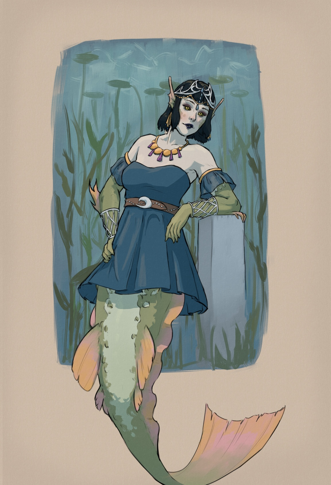

+++
title = "Aava"
date = 2025-04-19
updated = 2026-04-18
[extra]
container_classes = "gallery-container"
character = "Aava"
main_image = "aava_square.jpg"
main_image_alt = """Pale-skinned mermaid with dark bob-cut hair,
wearing a tiara, some jewelry, and a bikini top."""
+++

Merfolk are uniquely well suited for the study of marine biology
(on account of the ability to stay underwater indefinitely),
so many of their institutes of higher learning are focused on the topic.
Aava is one young researcher in the field and an amateur sculptor,
with an ostentatious fashion sense typical of her people.

<!-- more -->

Body details and alternative outfits:

