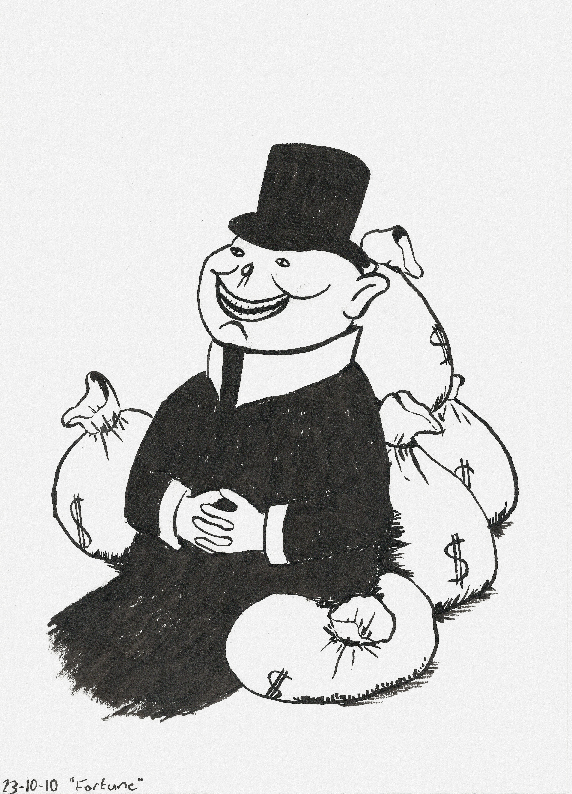
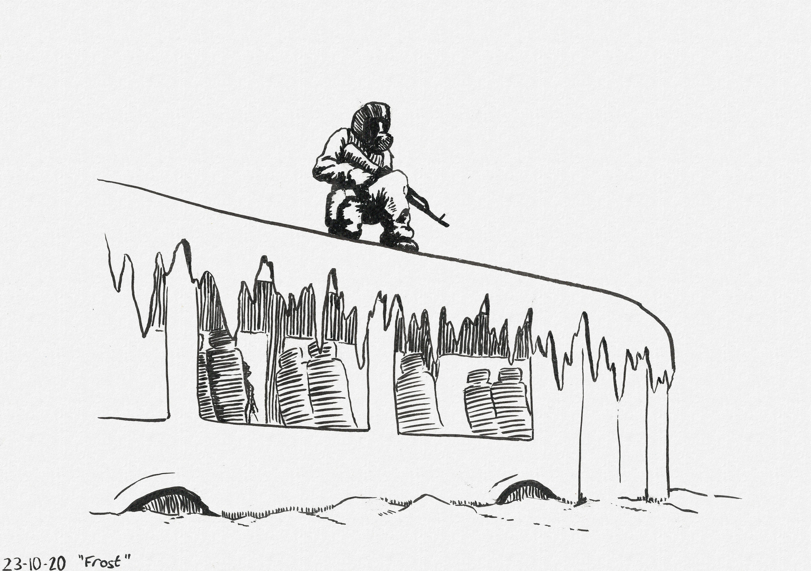
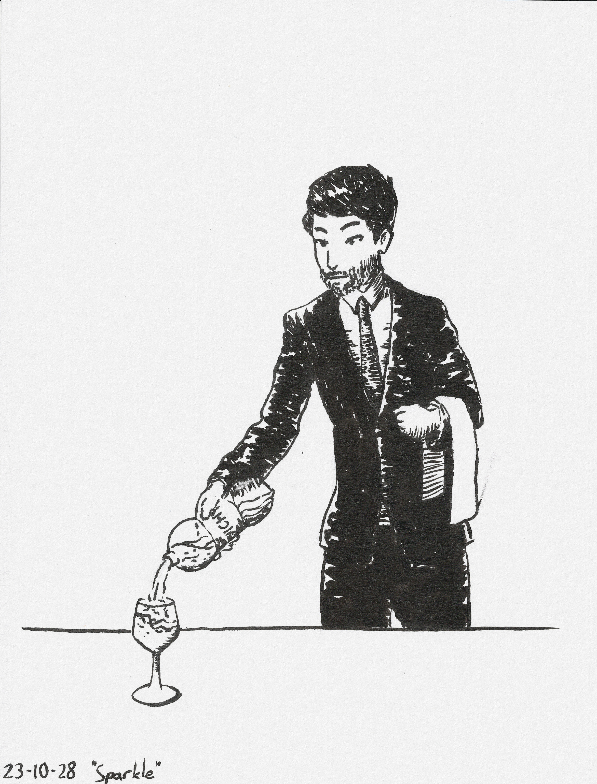

+++
title = "Inktober 2023"
date = 2023-10-31
[extra]
license = "Multiple"
container_classes = "gallery-container"
main_image = "02_spiders.jpg"
main_image_alt = """A lady wearing a black dress
with a spiderweb pattern on the back.
She has a spiderweb hanging on her arm and spiders crawling all around."""
skip_main_image = true
+++

Quick drawings done every other day for Inktober 2023,
all made with a Pentel Pocket Brush brush pen.

<!-- more -->

Everything under the "Originals" header is licensed CC0.
The fanart is all rights reserved by the respective IP holders.

## Originals

## Fanart

