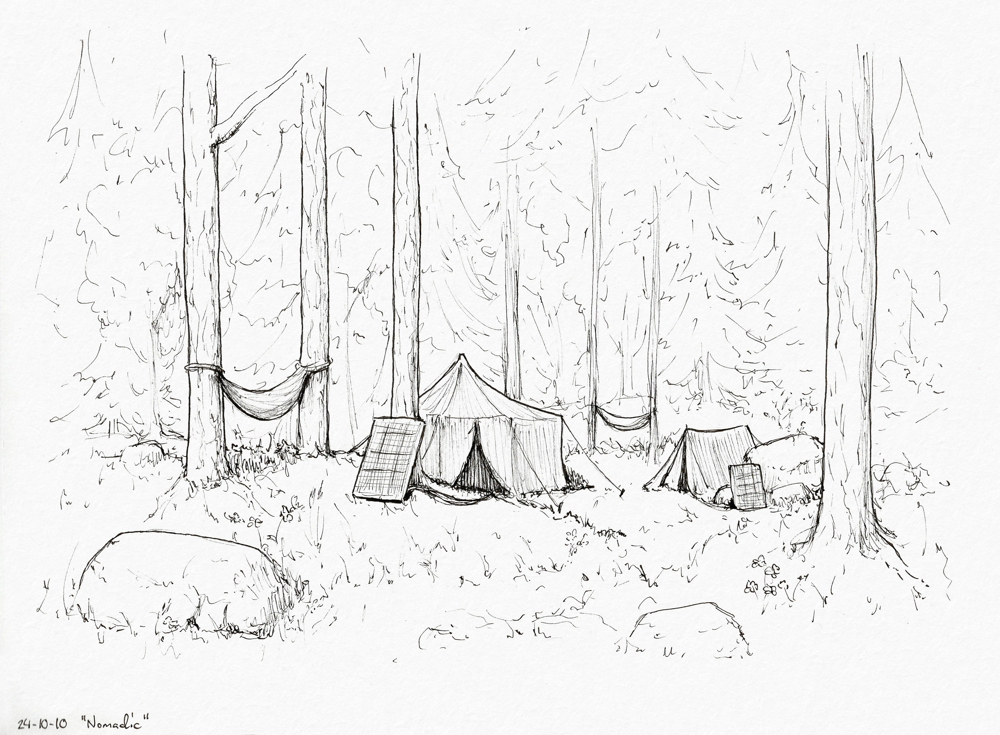
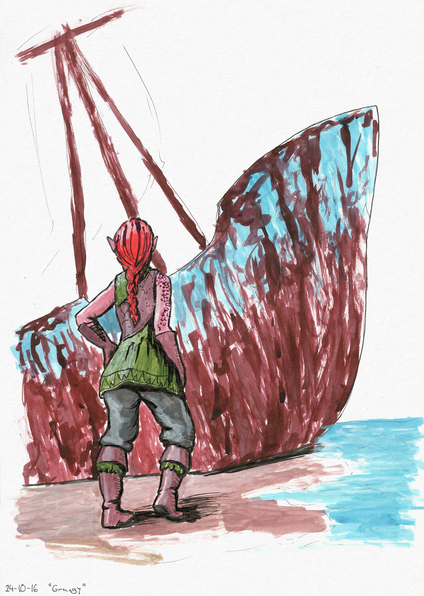
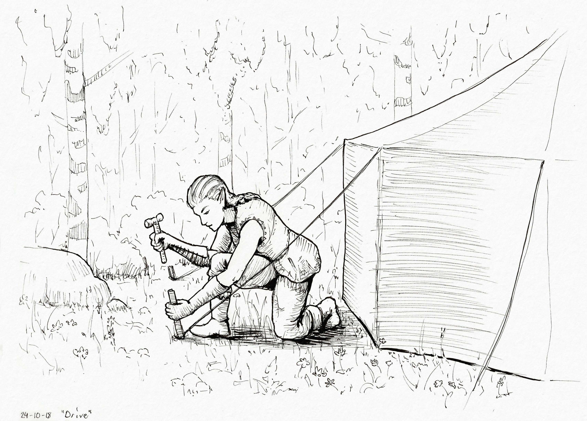
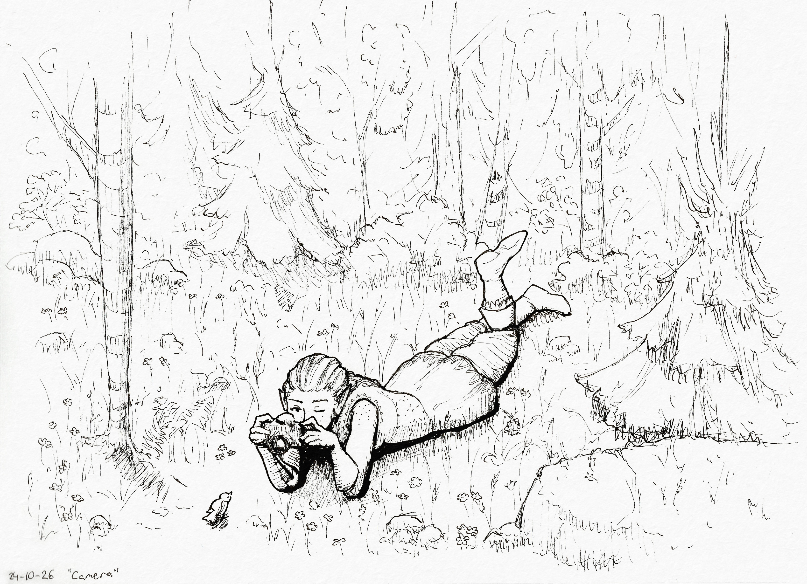

+++
title = "Inktober 2024"
date = 2024-10-31
[extra]
container_classes = "gallery-container"
main_image = "camera.jpg"
main_image_alt = """Black and white ink drawing of Miriel the forest elf
lying down on her stomach with a camera,
taking a picture of a small bird standing on the ground."""
skip_main_image = true
+++

I did Inktober every other day again this year,
incorporating colored inks for the first time
to varying levels of success.
I used the travel-themed prompts to explore [Miriel](../miriel/)'s adventures
and develop the world she lives in.

<!-- more -->

## 02. Discover

## 04. Exotic

The mountain dwarves' massive wind farms are certainly an exotic sight
for the forest elves whose energy needs are met by firewood and a few solar panels.

## 06. Trek

## 08. Hike

## 10. Nomadic

The forest elves spend their summers hunting and foraging in small groups,
living in lightweight camps, converging back to permanent settlements for the winter.

## 12. Remote

The elves may live a simple life, but that doesn't mean they reject technology.
A portable radio, for instance, is very handy out in the wild.

A failed color experiment where I made things too dark at first
and tried my best to pull it back by glazing white ink on top.
In hindsight a better solution would have been to make the darkest parts even darker.

## 14. Roam

## 16. Grungy

## 18. Drive

## 20. Uncharted

## 22. Camp

## 24. Expedition

Trading for produce at a nearby human settlement's community pantry.

## 26. Camera

## 28. Jumbo

After the merfolk realized how much easier it was to get food
by farming and fishing rather than luring sailors to their deaths,
they've been mostly preoccupied with art and architecture.

## 30. Violin

The annual harvest festival marks the elves' return
to their winter dwellings.
