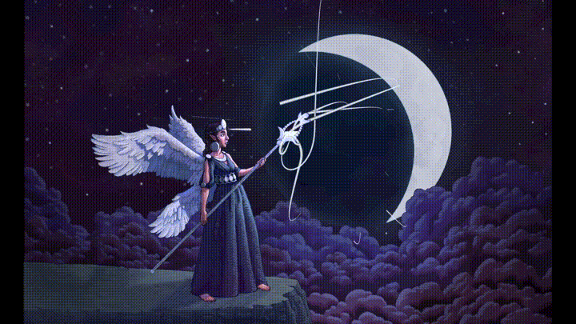

+++
title = "Don't forget to charge your moon staff"
date = 2024-04-30
[extra]
container_classes = "gallery-container"
main_image = "moonstaff.jpg"
main_image_alt = """
A woman in a long blue dress standing on a mountain cliff,
surrounded by clouds and lit by a crescent moon.
She has two pairs of wings on her back and points a staff towards the moon.
Glowing particles stream from the moon to the staff.
"""
+++

Animated version made using my game engine [Starframe](https://github.com/m0lentum/starframe):

Proof of concept for my new graphics workflow and lighting system.

- [Longer high-res video on Mastodon](https://mastoart.social/@molentum/112356769833978681)
- [Source code on GitHub](https://github.com/m0lentum/art)

<!-- more -->

