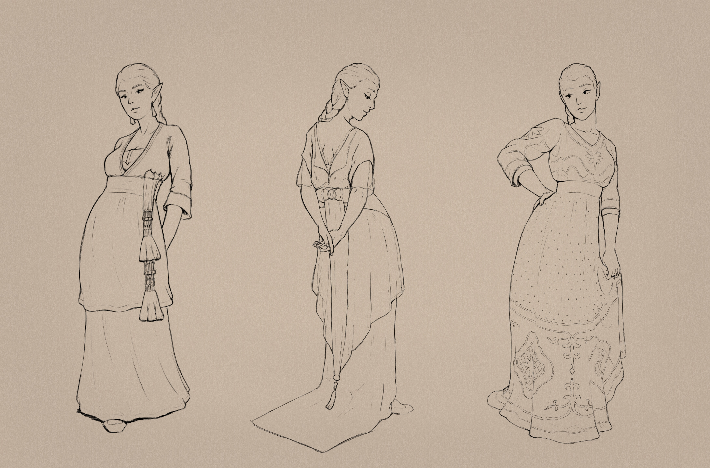

+++
title = "1910s dress-up"
date = 2025-02-20
[extra]
container_classes = "gallery-container"
main_image = "1910s-dressup.jpg"
main_image_alt = """Three portraits of a red-haired elven woman
wearing different floor-length evening dresses.
The first has a double-layered skirt, sleeves decorated with colorful thread and beads,
and a decorative sash hanging off the waist.
The second has short translucent sleeves, a sheer layer of decorative skirt,
and a long  hem that trails along the floor, made of cloth decorated with shiny embroidery.
The third is simpler in form, decorated with geometric patterns on the bust and hem."""
+++

Some historical dresses from the 1910s
(found via [The Dreamstress](https://thedreamstress.com/category/rate-the-dress/);
original sources are various museums)
worn by [Miriel](/gallery/2024/miriel/) because why not.
Working my way out of a slump with some comfort zone portraits.

<!-- more -->

Bonus lineart-only version:

