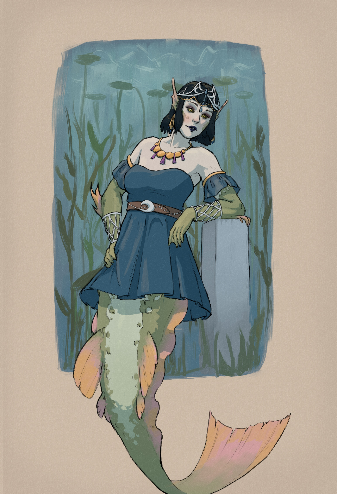

+++
title = "Character design: Aava"
date = 2025-04-19
[taxonomies]
characters = ["Aava"]
[extra]
license = "CC0"
container_classes = "gallery-container"
main_image = "aava_halter_fancy.jpg"
main_image_alt = """Digital drawing of a mermaid wearing a skimpy halter top
with an embroidered belt around the waist and chains of jewelry hanging off it.
She also wears various other jewelry around the arms and the head and heavy smoky-eye makeup.
Her body is colored with drab greens and grays, evoking some kind of Nordic freshwater fish.
"""
enable_webmentions = true
mastodon_url = "https://mastoart.social/@molentum/114364420610898911"
+++

Aava is a marine biologist studying river ecosystems
and an amateur sculpture artist.
Like most merfolk, she likes to wear ostentatious clothes and jewelry,
even if they aren't always entirely practical.

<!-- more -->

See also: [Yon](/notes/yon/)

Body details and alternative outfits:

