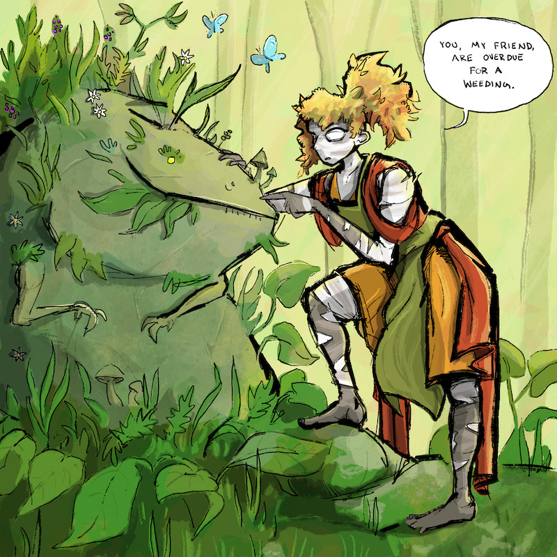

+++
title = "Art Fight 2025"
date = 2025-08-01
[taxonomies]
characters = ["Aava", "Miriel", "Ivu", "Olivia"]
[extra]
license = "Multiple"
container_classes = "gallery-container"
main_image = "thumbnail.jpg"
main_image_alt = """A grid of four drawings in different styles featuring various characters."""
skip_main_image = true
enable_webmentions = false
+++

I participated in [Art Fight] for the first time,
where I semi-accidentally ended up challenging myself
to make as many drawings as I can without ever repeating a style.
I've compiled my "attacks" and "defenses" on this page.
Big thanks to everyone involved for making such lovely art
and allowing me to post it!

<!-- more -->


One defense is still pending permission from the creator.
I'll update the page when they reply.


For the uninitiated, Art Fight is a game taking place over the month of July
where artists draw (or sculpt, or animate, or crochet, or ...) each other's characters.
Sending somebody an artwork is referred to as an "attack",
which generates points for your team,
and receiving an artwork is called a "defense".
So the "attacks" here are my drawings of other people's characters,
and "defenses" are others' drawings of my characters.
If you have an Art Fight account, you can also browse these on [my profile].

The license for these images is All rights reserved unless specified otherwise.

## Attacks

"Box bunny's book break" featuring Box Bunny for [DasMetalKitty] (character designed by [bestiaexmachina])

"I don't know anything about ffxiv" featuring Juritta for [redstrate]

"At a metal show" featuring Sciasm for [bestiaexmachina]

"I see a pretty dress, I draw it" featuring Lois for [fluffyfied]

"Watering the polygons" featuring Myna for [ZebraFeatherAH]

"A smooth landing" featuring Kaleen Windstriker for [DaQueen]

"Timeweaver" featuring Ura for [loude]

"Just standing around being mysterious" featuring Mabe for [sillygobbo]

## Defenses

"Aava swimming" by [DasMetalKitty]

Miriel by [fluffyfied]

"Lookin a bit scruffy..." featuring Ivu by [ZebraFeatherAH]

Olivia by [bestiaexmachina] (license: [CC BY-NC-SA])

Miriel by [loude] (license: [CC BY-NC-ND])

"So Close" featuring Aava by [redstrate] (license: [CC BY-NC-SA])

Aava by [sillygobbo]

[art fight]: https://artfight.net/
[my profile]: https://artfight.net/~Molentum
[DasMetalKitty]: https://mastoart.social/@Kitty
[bestiaexmachina]: https://artfight.net/~bestiaexmachina
[redstrate]: https://redstrate.com/
[fluffyfied]: https://fluffyfied.carrd.co/
[ZebraFeatherAH]: https://sunny.garden/@ZebraFeatherAH
[DaQueen]: https://artfight.net/~DaQueen
[loude]: https://mastodon.art/@loude
[sillygobbo]: https://bsky.app/profile/sillygobbo.bsky.social

[CC BY-SA]: https://creativecommons.org/licenses/by-sa/4.0/
[CC BY-NC-SA]: https://creativecommons.org/licenses/by-nc-sa/4.0/
[CC BY-NC-ND]: https://creativecommons.org/licenses/by-nc-nd/4.0/
