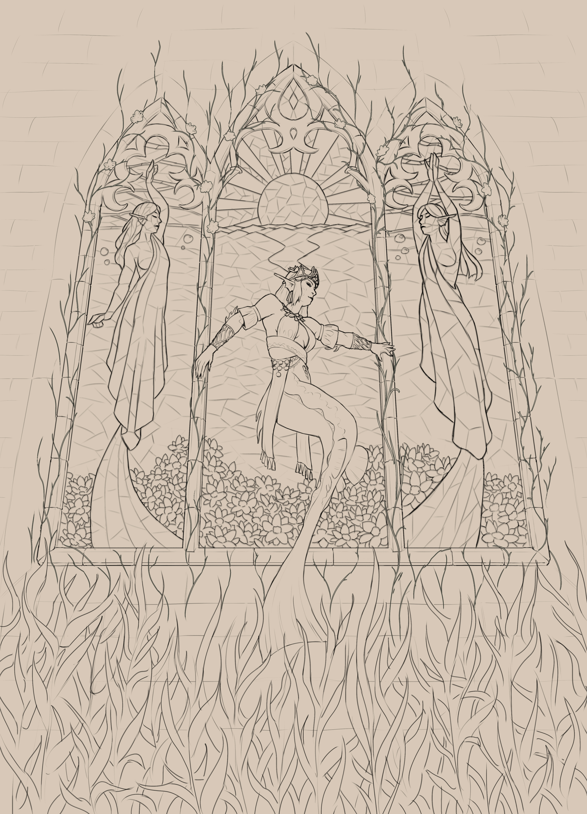

+++
title = "Big fancy window"
date = 2025-05-21
[taxonomies]
characters = ["Aava"]
[extra]
container_classes = "gallery-container"
main_image = "window.jpg"
main_image_alt = """Digital painting of a mermaid
posing in front of a row of three stained glass windows on an underwater stone wall.
The window directly behind her depicts a sunset over water,
and to her sides are two mermaids wearing white drapery.
The window is the dominant light source,
making bright beams in the water and a stark contrast with everything else."""
enable_webmentions = false
mastodon_url = ""
+++

The merfolk's architecture is just as needlessly dramatic as their fashion.

<!-- more -->

Lineart:

