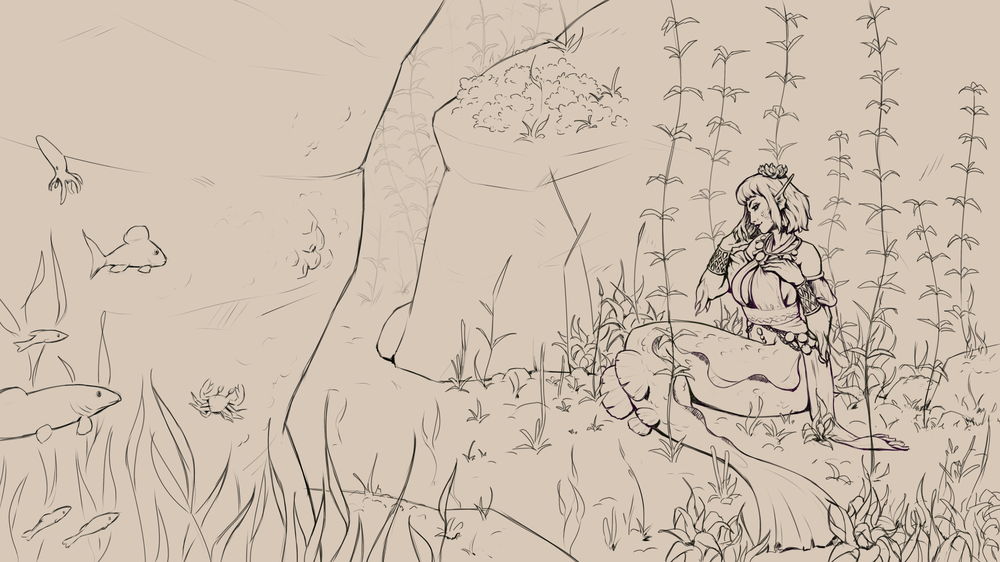
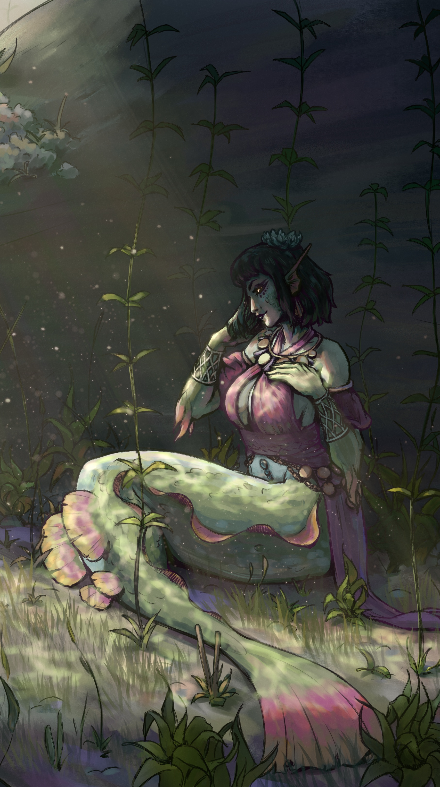

+++
title = "Siren's gaze"
date = 2026-01-18
[taxonomies]
characters = ["Aava"]
[extra]
license = "CC0"
container_classes = "gallery-container"
main_image = "sirens_gaze.jpg"
main_image_alt = """Digital painting of Aava the mermaid sitting somewhere underwater.
She's wearing her jewelled pink halter top and surrounded by rocks and foliage,
a bright light reaching her body from between the rocks but leaving her face in shadow.
She's stroking her hair with a hand, resting the other on her breast,
and looking sidelong at us in a playfully inviting but also slightly sinister gesture.
There's a lot of empty space in the image, implying that we're a bit of distance away,
perhaps unsure whether to accept her invitation."""
skip_main_image = false
enable_webmentions = false
mastodon_url = ""
+++

Many generations have passed since the merfolk ended the practice
of using seduction to procure food,
but Aava still knows the art of the Look 👁 👁

<!-- more -->

Lineart and a cropped "phone wallpaper" variant:

